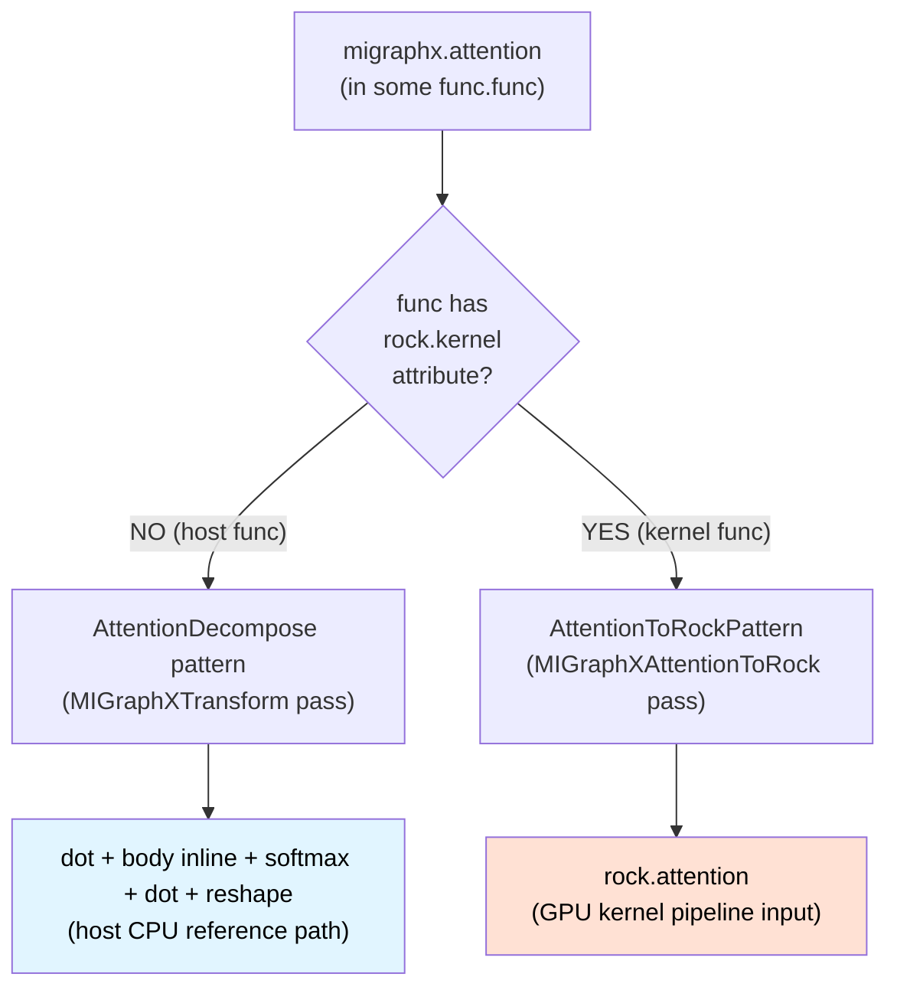
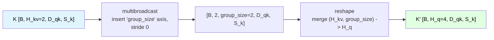
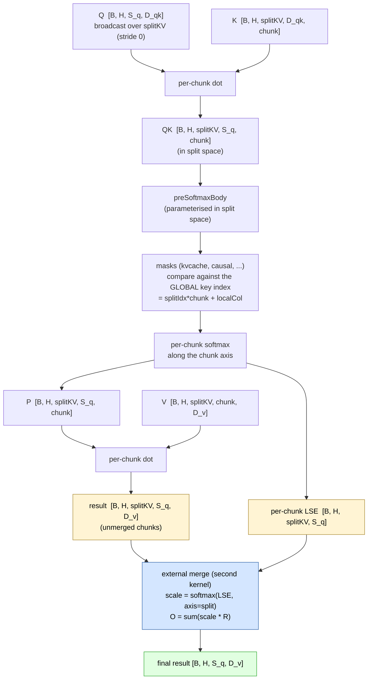
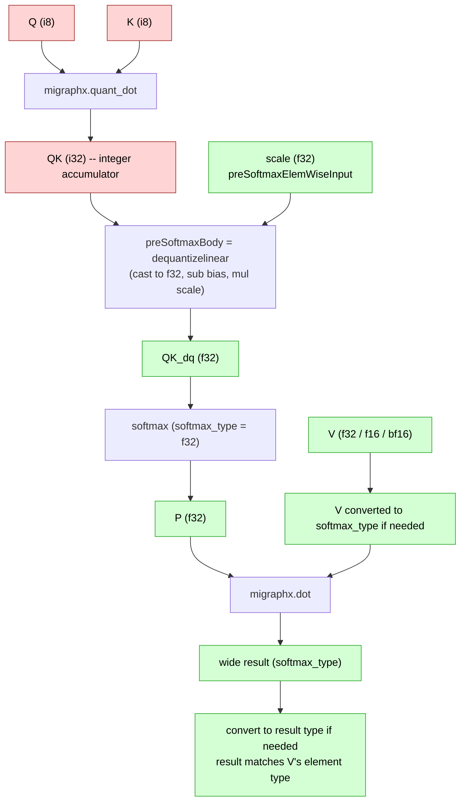

# `migraphx.attention`

This is the developer reference for the `migraphx.attention` operation in
the MIGraphX MLIR dialect: what it computes, what variants it supports,
how its verifier rejects malformed IR, how it is lowered to either a
host-side primitive sequence or a GPU `rock.attention` kernel, and how
external callers build it through the C API.

The canonical operation definition (operands, attributes, region,
assembly format) lives in [`MIGraphX.td`][td]. This document focuses on
the cross-cutting contracts that span the verifier
([`MIGraphX.cpp`][verifier]), the host decompose
([`MIGraphXTransform.cpp`][hostlower]), the GPU lowering
([`MIGraphXAttentionToRock.cpp`][gpulower]), the C API
([`MIGraphX.cpp` CAPI][capi], [`MIGraphX.h` CAPI][capih]), and the
`rocmlir-gen` driver. Anything below that mentions a "shared
contract" implies the same rule has to hold in every one of those files
and any future change must touch all of them.

[td]: ../../include/mlir/Dialect/MIGraphX/IR/MIGraphX.td
[types]: ../../include/mlir/Dialect/MIGraphX/IR/MIGraphXTypes.td
[utils]: ../../include/mlir/Dialect/MIGraphX/IR/AttentionUtils.h
[verifier]: ../../lib/Dialect/MIGraphX/IR/MIGraphX.cpp
[hostlower]: ../../lib/Dialect/MIGraphX/Transforms/MIGraphXTransform.cpp
[gpulower]: ../../lib/Conversion/MIGraphXAttentionToRock/MIGraphXAttentionToRock.cpp
[capih]: ../../include/mlir-c/Dialect/MIGraphX.h
[capi]: ../../lib/CAPI/Dialect/MIGraphX.cpp
[pipeline]: ../../lib/Dialect/MIGraphX/Pipeline/Pipeline.cpp
[rockattn]: ../../include/mlir/Dialect/Rock/IR/RockOps.td
[detect-flash-decoding]: ../../lib/Dialect/Rock/Transforms/DetectFlashDecoding.cpp
[fusion-utils]: ../../lib/Dialect/Rock/utility/fusionUtils.cpp
[rocmlir-gen]: ../../tools/rocmlir-gen/rocmlir-gen.cpp
[flash-decoding-blog]: https://pytorch.org/blog/flash-decoding/
[hydragen]: https://arxiv.org/abs/2402.05099
[pr-splitkv-impl]: https://github.com/ROCm/rocMLIR/pull/1895
[pr-detect-flash-decoding]: https://github.com/ROCm/rocMLIR/pull/2101
[pr-detect-flash-decoding-kvcache]: https://github.com/ROCm/rocMLIR/pull/2174
[pr-splitkv-fusion]: https://github.com/ROCm/rocMLIR/pull/2254
[migraphx-issue-flash-decoding]: https://github.com/ROCm/AMDMIGraphX/issues/4334

## Contents

- [1. Background](#1-background)
- [2. Operands, attributes, and the math](#2-operands-attributes-and-the-math)
  - [2.1 Operands and result shapes](#21-operands-and-result-shapes)
  - [2.2 The mathematical pipeline](#22-the-mathematical-pipeline)
  - [2.3 The pre-softmax body](#23-the-pre-softmax-body)
- [3. Variants](#3-variants)
  - [3.1 `splitkv` (flash decoding)](#31-splitkv-flash-decoding)
    - [Why split the K dimension? (the decode bottleneck)](#why-split-the-k-dimension-the-decode-bottleneck)
    - [Algorithm (numpy reference)](#algorithm-numpy-reference)
    - [Op-level contract](#op-level-contract)
    - [Worked example with shapes](#worked-example-with-shapes)
    - [K dimension partition](#k-dimension-partition)
    - [Per-chunk dataflow](#per-chunk-dataflow)
    - [Mask handling under splitKV](#mask-handling-under-splitkv)
    - [How MIGraphX feeds splitKV into rocMLIR](#how-migraphx-feeds-splitkv-into-rocmlir)
    - [Fusion behavior](#fusion-behavior)
    - [Further reading](#further-reading)
  - [3.2 `causal` (lower-triangular masking)](#32-causal-lower-triangular-masking)
  - [3.3 `prefix_offset` (prefix-causal masking)](#33-prefix_offset-prefix-causal-masking)
  - [3.4 `kvcache` (decode-style attention with per-batch valid-key boundary)](#34-kvcache-decode-style-attention-with-per-batch-valid-key-boundary)
  - [3.5 `sliding_window` (recent-key window)](#35-sliding_window-recent-key-window)
  - [3.6 Variant cheat-sheet](#36-variant-cheat-sheet)
  - [3.7 Mask composition](#37-mask-composition)
- [4. Allowed feature combinations and verifier rationale](#4-allowed-feature-combinations-and-verifier-rationale)
  - [4.1 Rank, static-shape, and element-type rules](#41-rank-static-shape-and-element-type-rules)
  - [4.2 Inner-dimension agreement (`Q*K^T` and `S*V`)](#42-inner-dimension-agreement-qkt-and-sv)
  - [4.3 Leading-dim agreement and GQA](#43-leading-dim-agreement-and-gqa)
  - [4.4 splitKV-aware shape construction](#44-splitkv-aware-shape-construction)
  - [4.5 Leading-dim shape rule for `currentSeqLen` and `prefixOffset`](#45-leading-dim-shape-rule-for-currentseqlen-and-prefixoffset)
  - [4.6 Feature ↔ operand ↔ attribute pairings](#46-feature--operand--attribute-pairings)
  - [4.7 softmaxType rules](#47-softmaxtype-rules)
  - [4.8 result element type](#48-result-element-type)
  - [4.9 Pre-softmax body validation](#49-pre-softmax-body-validation)
- [5. The pre-softmax body contract (in detail)](#5-the-pre-softmax-body-contract-in-detail)
- [6. Quantized Int8 attention](#6-quantized-int8-attention)
  - [6.1 First GEMM is `migraphx.quant_dot`](#61-first-gemm-is-migraphxquant_dot)
  - [6.2 The dequant-in-body rule](#62-the-dequant-in-body-rule)
  - [6.3 Combining `i8` with other features](#63-combining-i8-with-other-features)
  - [6.4 What happens if I skip the dequant?](#64-what-happens-if-i-skip-the-dequant)
- [7. CPU lowering (`AttentionDecompose` in `migraphx-transform`)](#7-cpu-lowering-attentiondecompose-in-migraphx-transform)
  - [7.1 GQA broadcast (rank 4 only)](#71-gqa-broadcast-rank-4-only)
  - [7.2 SplitKV reshape (when `splitkv` is set)](#72-splitkv-reshape-when-splitkv-is-set)
  - [7.3 First GEMM](#73-first-gemm)
  - [7.4 Inline the body](#74-inline-the-body)
  - [7.5 Convert to softmax type before masking](#75-convert-to-softmax-type-before-masking)
  - [7.6 Apply masks (causal, sliding-window, kv-cache)](#76-apply-masks-causal-sliding-window-kv-cache)
  - [7.7 Softmax (or LSE-aware decomposition)](#77-softmax-or-lse-aware-decomposition)
  - [7.8 Second GEMM (with the mfma-style widen)](#78-second-gemm-with-the-mfma-style-widen)
  - [7.9 LSE reshape](#79-lse-reshape)
  - [7.10 Pipeline integration](#710-pipeline-integration)
  - [7.11 Discardable attributes (perf_config)](#711-discardable-attributes-perf_config)
- [8. GPU lowering (`MIGraphXAttentionToRock`)](#8-gpu-lowering-migraphxattentiontorock)
  - [8.1 The polarity contract](#81-the-polarity-contract)
  - [8.2 MIXR -> tensor adaptor](#82-mixr---tensor-adaptor)
  - [8.3 Collapse to 3D](#83-collapse-to-3d)
  - [8.4 Heads detection](#84-heads-detection)
  - [8.5 Building the `rock.attention` op](#85-building-the-rockattention-op)
  - [8.6 perf_config forwarding](#86-perf_config-forwarding)
  - [8.7 `preSoftmaxHasSplitKVTransforms`](#87-presoftmaxhassplitkvtransforms)
  - [8.8 Body construction in `rock.attention`](#88-body-construction-in-rockattention)
  - [8.9 What happens after `rock.attention`](#89-what-happens-after-rockattention)
- [9. C API](#9-c-api)
  - [9.1 Feature flag macros](#91-feature-flag-macros)
  - [9.2 The constructor](#92-the-constructor)
  - [9.3 Boundary contract checks](#93-boundary-contract-checks)
  - [9.4 Op assembly](#94-op-assembly)
  - [9.5 Pipeline entry points](#95-pipeline-entry-points)
- [10. Adding a new feature flag](#10-adding-a-new-feature-flag)

## 1. Background

Scaled dot-product attention is the core primitive used by transformer
models. Given a query `Q`, key `K`, and value `V` matrix, attention
computes

$$
\text{Attention}(Q, K, V) = \text{softmax}\bigl(f(Q K^\top, \dots)\bigr) \, V
$$

where `f` is an optional elementwise pre-softmax computation that
expresses scaling (`1 / sqrt(d_k)`), additive masking, additive bias,
or whatever the producer (MIGraphX) needs to fuse into the attention
node before lowering it to a kernel.

In real workloads the same operation is asked to cover many related
problems:

- Prefill (long Q sequence) and decode (Q sequence of length 1) for
  generative models.
- Standard multi-head attention (MHA) and grouped-query attention (GQA)
  where Q has more heads than K/V.
- KV-cache attention with a per-batch valid-key boundary
  (`currentSeqLen` is the inclusive last valid key index, not a
  count), optional causal masking, optional sliding window, and
  optional per-batch prefix offsets.
- Flash decoding (split-K attention) where the K sequence dim is
  partitioned across blocks for higher occupancy on small Q sequences.
- INT8 quantized Q/K with float V, where the first GEMM is integer and
  the body has to dequantize before softmax.

`migraphx.attention` is the high-level node that captures all of these
in a single op, with a region that names the elementwise fusion and a
small set of feature flags that select the variant. In the rocMLIR
pipeline two consumers absorb the op:

| Consumer | Activation polarity | Result |
|----------|---------------------|--------|
| `MIGraphXAttentionToRock` | functions tagged `rock.kernel` | exactly one `rock.attention` (the kernel generator's input) |
| `AttentionDecompose` (in `migraphx-transform`) | functions **not** tagged `rock.kernel` | a sequence of primitive `migraphx.dot` / `softmax` / mask ops (the host CPU reference) |

Both passes are scheduled in sequence in
`migraphx::addHighLevelPipeline` (see [`Pipeline.cpp`][pipeline]),
with a canonicalizer in between -- the opposite `rock.kernel`
polarity guards let them coexist in the same pipeline run. That
contract is pinned by
[`attention-pipeline-polarity.mlir`][polaritytest].

The two-pass routing is:



Both passes always run on every function; the polarity guard on each
side just makes the other pass a no-op for that function.

[polaritytest]: ../../test/Conversion/MIGraphXAttentionToRock/attention-pipeline-polarity.mlir

## 2. Operands, attributes, and the math

### 2.1 Operands and result shapes

```text
result, [lse] = migraphx.attention
                  Q, K, V
                  pre_softmax_inputs(extras... : <extras-types>)
                  current_seq_len  (seqLen     : <seqlen-type>)
                  prefix_offset    (offset     : <offset-type>)
                  { preSoftmaxBody }
                  softmax_type      = ?fT
                  features          = ?bitset
                  splitKV           = ?N
                  slidingWindowSize = ?W
                  : <Q-type>, <K-type>, <V-type> -> <result-type> [, <lse-type>]
```

This sketch follows the assembly format declared in
[`MIGraphX.td`][td]: `Q`, `K`, `V` are comma-separated, each optional
operand group is rendered as `name(SSA-value : type)`, and there are
no commas between the optional groups or between the body and the
trailing attribute clauses. See the `assemblyFormat` block of
`MIGraphX_AttentionOp` for the exact textual grammar.

The shapes follow the standard SDPA layout, with one or two leading
dims depending on whether you are encoding heads explicitly:

| Operand | Element type | Shape (rank 3) | Shape (rank 4) |
|---------|--------------|----------------|----------------|
| `Q` (queries) | `f32`/`f16`/`bf16`/`i8` | `[B, S_q, D_qk]` | `[B, H_q, S_q, D_qk]` |
| `K` (keys)    | same as `Q` | `[B, D_qk, S_k]` | `[B, H_kv, D_qk, S_k]` |
| `V` (values)  | `f32`/`f16`/`bf16` | `[B, S_k, D_v]` | `[B, H_kv, S_k, D_v]` |
| `result`      | same as `V` | `[B, S_q, D_v]` | `[B, H_q, S_q, D_v]` |
| `lse` (opt.)  | matches softmax type (`f32`/`f16`/`bf16`; see `AttentionLseTypes` in [`MIGraphX.td`][td]) | `[B, S_q]` | `[B, H_q, S_q]` |

Notation: `B` is batch, `H_q` / `H_kv` are query- and KV-heads (with
`H_q % H_kv == 0` when they differ), `S_q` is the query sequence
length, `S_k` is the key sequence length, `D_qk` is the per-head Q/K
embedding dim, and `D_v` is the per-head V embedding dim
([`MIGraphX.td`][td] uses the names `head_qk` and `head_v` for the
same axes). Rank 3 is the "batch already includes heads" form;
rank 4 is the canonical MHA / GQA form where heads live at dim 1.

**MHA vs GQA at the heads axis** (rank-4 form):

```text
MHA (H_q = H_kv = 4)               GQA (H_q = 4, H_kv = 2, group_size = 2)

  Q heads:  0   1   2   3            Q heads:  0   1   2   3
            |   |   |   |                      |   |   |   |
            v   v   v   v                      v   v   v   v
  K/V hd:   0   1   2   3            K/V hd:    0       1
                                      (each K/V head is shared by
                                       group_size = H_q/H_kv = 2
                                       consecutive Q heads)
```

The two lowerings handle the broadcast differently. The host decompose
materialises K/V replication explicitly so the rest of the pipeline
sees a regular MHA layout:



(`V` is broadcast the same way; see
[§7.1](#71-gqa-broadcast-rank-4-only).) The GPU lowering instead
encodes `(numHeadsQ, numHeadsKV)` as attributes on `rock.attention`
and the gridwise lowering applies the group broadcast inside the
kernel.

When `splitkv` is enabled the result and LSE shapes get an extra split
axis inserted between the leading dims and the trailing seq/dim axes
(see [§3.1](#31-splitkv-flash-decoding)).

`current_seq_len` and `prefix_offset` are optional `i32` / `si32`
operands carrying per-batch (or per-batch-per-head) integer scalars.
Their shape must equal Q's leading dims exactly: `[B]` for rank-3 Q,
`[B, H_q]` for rank-4 Q. The op refuses to broadcast them implicitly
across heads; see [§4.5](#45-leading-dim-shape-rule-for-currentseqlen-and-prefixoffset).

### 2.2 The mathematical pipeline

Reading inside out, `migraphx.attention` computes:

1. **First GEMM (`QK = Q · K^T`).** For float `Q` this is
   `migraphx.dot` and the output element type matches `Q`. For integer
   `Q` (currently only `i8`) this is `migraphx.quant_dot` and the
   output is `i32`. The first-GEMM type rule is centralised in the
   shared helper [`computeAttentionQKElemType`][utils] so the verifier,
   the host decompose, and `rocmlir-gen` all agree on what
   `block.getArgument(0)` of the body has to be:

   ```cpp
   inline Type computeAttentionQKElemType(Type qElemType, MLIRContext *ctx) {
     if (isa<FloatType>(qElemType))
       return qElemType;
     return IntegerType::get(ctx, 32);  // i8 Q -> i32 QK
   }
   ```

2. **`preSoftmaxBody` fusion.** A single-block region that takes the
   `QK` result as block argument 0, the variadic
   `preSoftmaxElemWiseInputs` as block arguments `1..N` (in
   declaration order), and yields a new tensor of the same logical
   shape as `QK`. This is where masking, scaling, bias addition, and
   dequantization live. The full contract is in [§5](#5-the-pre-softmax-body-contract-in-detail).
   When the body is empty, the yielded value is conceptually just `QK`
   and the operand list must be empty too.

3. **`softmax`.** Row-wise softmax along the trailing key axis
   (`QK.shape[-1]`). Without `splitkv` this is `S_k`; with `splitkv`
   it is the per-split key axis `S_k / splitKV` -- each chunk gets
   its own per-row softmax computed independently in split space, and
   the cross-chunk merge happens externally using the per-chunk LSE
   (not here). Softmax runs in `softmaxType` if set, otherwise in
   `V`'s element type. The verifier requires `softmaxType` to be one
   of `f16`, `bf16`, `f32` (no `f64`, no exotic floats).

4. **Second GEMM (`P · V`).** A second `migraphx.dot` between the
   softmax probabilities and `V`. To match the GPU's mfma path, which
   keeps the gemm-1 accumulator in `softmaxType` and downcasts at the
   end, the host decompose widens `V` to `softmaxType` before the dot
   and downcasts the result to `V`'s element type after. The verifier
   forces `result.elementType == V.elementType` so callers don't try to
   express a custom output dtype directly on the op.

5. **Optional log-sum-exp output.** When `lse` is present the
   softmax is decomposed manually so the running `max` and `sum` are
   visible: `lse = log(sum(exp(QK - max))) + max`. The host decompose
   computes LSE in `softmaxType` and the verifier forces
   `lse.elementType == effective_softmax_type` so the LSE never has
   more precision than the running softmax it was derived from.

### 2.3 The pre-softmax body

The `preSoftmaxBody` is an MLIR region attached to the op. Its block
arguments are:

```mlir
^bb0(%qk: !migraphx.shaped<...QK shape...>,
     %extra0: !migraphx.shaped<...same shape as QK...>,
     %extra1: !migraphx.shaped<...same shape as QK...>,
     ...)
```

- Block argument 0 is always the `Q · K^T` result. Its shape and
  element type are derived from `Q` / `K` by the verifier (and the
  shared `computeAttentionQKElemType` helper for the element type),
  see [`AttentionOp::verify`][verifier].
- Block arguments `1..N` are the `preSoftmaxElemWiseInputs` in
  declaration order. The host decompose
  ([`AttentionDecompose`][hostlower]) maps `block.getArgument(i+1) ->
  preSoftmaxElemWiseInputs[i]` and the GPU lowering does the
  equivalent mapping into the rock body. Reordering is not allowed.

Inside the block only ops in the closed allowlist
[`isAllowedInPreSoftmaxBody`][utils] may appear (plus the
`migraphx.yield` terminator):

```cpp
inline bool isAllowedInPreSoftmaxBody(Operation &op) {
  return isa<migraphx::AddOp, migraphx::SubOp, migraphx::MulOp, migraphx::DivOp,
             migraphx::PowOp, migraphx::NegOp, migraphx::AbsOp,
             migraphx::CeilOp, migraphx::FloorOp, migraphx::ExpOp,
             migraphx::LogOp, migraphx::SqrtOp, migraphx::TanhOp,
             migraphx::ErfOp, migraphx::RecipOp, migraphx::ReluOp,
             migraphx::SigmoidOp, migraphx::WhereOp, migraphx::ConvertOp,
             migraphx::DeQuantizeLinearOp>(op);
}
```

The terminator must be `migraphx.yield`. The yielded value's shape
must match the `QK` shape and **its element type must be a float
type** (softmax requires a float input; for integer Q this means the
body must dequantize the i32 QK before yielding -- see
[§6](#6-quantized-int8-attention)). The specific float type is
otherwise free, and is what enters softmax (with a convert inserted
by the lowering when it differs from the effective softmax type).

The empty-body form (a bare `migraphx.yield` with no operand) is
reserved for "no fusion needed". It requires zero
`preSoftmaxElemWiseInputs` and a float `Q`. Integer `Q` is rejected
in the empty case because there is no way for the lowering to
synthesize a dequantization scale (see
[§6 Quantized Int8 attention](#6-quantized-int8-attention)).

## 3. Variants

`features` is a composable bit-flag enum ([`MIXR_AttentionFeaturesAttr`][types])
that selects attention variants. They are designed to compose cleanly:
features that are independent (e.g. `causal` and `splitkv`) can be
combined freely, and features that depend on others (e.g.
`sliding_window` requires `kvcache`) are checked by the verifier.

| Bit | Feature | Required operand / attribute | Required co-feature |
|-----|---------|------------------------------|---------------------|
| 0 | `kvcache` | `currentSeqLen` operand | -- |
| 1 | `causal` | -- | -- |
| 2 | `prefix_offset` | `prefixOffset` operand | `causal` |
| 3 | `sliding_window` | `slidingWindowSize` attr, `currentSeqLen` operand | `kvcache` |
| 4 | `splitkv` | `splitKV` attr (> 1), `lse` result | -- |

When set, multiple flags are combined with `|` in textual IR, e.g.
`features = "kvcache|causal|sliding_window"`. The bare variant flag (no
features) is the standard prefill / training-style attention.

### 3.1 `splitkv` (flash decoding)

#### Why split the K dimension? (the decode bottleneck)

A standard attention kernel parallelizes work along `[B, H, S_q]`:
each GPU compute unit owns a tile of the `(S_q, D_v)` output. During
autoregressive decoding the model only generates one new token per
step, so `S_q = 1`. With small `B * H`, the kernel ends up launching
far fewer thread blocks than the GPU has compute units, and most of
the device sits idle even though the per-step work itself is large:
`S_k` (the KV-cache length) is typically thousands and grows with
context length, so the QK and PV products are not small at all -- they
just have nowhere to go.

Flash decoding ([PyTorch blog][flash-decoding-blog]) is the standard
fix. Instead of parallelizing over the (tiny) `S_q` axis, it
parallelizes over the (large) `S_k` axis: split the keys and values
into `G = splitKV` chunks, run attention on each chunk independently
(so the kernel now launches `B * H * G` thread blocks), and merge the
per-chunk partial outputs with a numerically-stable log-sum-exp
reduction. The merge formula itself is a streaming-softmax recurrence;
Hydragen [(Juravsky et al., 2024)][hydragen] gives a clean
self-contained derivation as their Eq. 5. PR [#1895][pr-splitkv-impl]
reports 6-8x end-to-end speedup on a llama2-style decode shape
(`g=32, S_q=1, D=128`) for `S_k` from 4k to 100k, with per-step time
becoming roughly constant in `S_k` instead of linear in it.

Because the static cache dimension `S_k` (the shape used for splitting)
is decoupled from the runtime KV occupancy, `splitkv` and `kvcache`
compose cleanly: `splitKV` decides how the *static* `S_k` slot is
chopped up for parallelism, while `currentSeqLen` decides which
positions inside that slot are actually valid.

#### Algorithm (numpy reference)

The algorithm has two stages. `migraphx.attention` with the `splitkv`
feature implements only the **first** stage (per-chunk attention plus
per-chunk LSE) and returns the unmerged chunks. The **second** stage
(LSE-weighted merge into the final result) lives outside the kernel,
either in the test driver ([`rocmlir-gen.cpp`][rocmlir-gen]) or in the
MIGraphX runtime as a separate pass (see issue
[AMDMIGraphX#4334][migraphx-issue-flash-decoding] for the canonical
specification of the second kernel).

The numpy program below is a runnable, executable specification of
both stages. It uses the same shape conventions as the op
(`Q [B, H, S_q, D_qk]`, `K [B, H, D_qk, S_k]`, `V [B, H, S_k, D_v]`)
and `merge_chunks(*first_kernel(...))` is bit-equivalent (up to fp
tolerance) to the plain reference attention.

```python
import numpy as np

def softmax(x, axis):
    m = x.max(axis=axis, keepdims=True)
    e = np.exp(x - m)
    return e / e.sum(axis=axis, keepdims=True)

def attention_reference(Q, K, V):
    """Plain scaled dot-product attention; the ground truth."""
    d = Q.shape[-1]
    return softmax((Q @ K) / np.sqrt(d), axis=-1) @ V

def attention_splitkv_first_kernel(Q, K, V, splitKV):
    """What rocMLIR's migraphx.attention (feature 'splitkv') computes.
       Returns the unmerged per-chunk outputs and the per-chunk LSE."""
    B, H, S_q, D_qk = Q.shape
    S_k = K.shape[-1]
    assert S_k % splitKV == 0           # verifier rule
    chunk = S_k // splitKV
    # Reshape K/V to expose the split axis at position 2.
    Ks = K.reshape(B, H, D_qk, splitKV, chunk).transpose(0, 1, 3, 2, 4)
    Vs = V.reshape(B, H, splitKV, chunk, V.shape[-1])

    O = np.zeros((B, H, splitKV, S_q, V.shape[-1]))
    LSE = np.zeros((B, H, splitKV, S_q))
    for g in range(splitKV):
        QK_g = (Q @ Ks[:, :, g]) / np.sqrt(D_qk)        # [B, H, S_q, chunk]
        m_g  = QK_g.max(axis=-1, keepdims=True)
        e_g  = np.exp(QK_g - m_g)
        s_g  = e_g.sum(axis=-1, keepdims=True)
        LSE[:, :, g] = (m_g + np.log(s_g)).squeeze(-1)  # log-sum-exp per chunk
        O[:, :, g]   = (e_g / s_g) @ Vs[:, :, g]        # [B, H, S_q, D_v]
    return O, LSE                                        # what the op returns

def merge_chunks(O, LSE):
    """The 'second kernel', run downstream of migraphx.attention.
       softmax(LSE, axis=split) gives the per-chunk merge weights."""
    w = softmax(LSE, axis=2)[..., None]                 # [B, H, G, S_q, 1]
    return (w * O).sum(axis=2)                          # [B, H, S_q, D_v]

np.random.seed(0)
Q = np.random.randn(1, 2,  1,  8)        # decode-style: S_q = 1
K = np.random.randn(1, 2,  8, 16)
V = np.random.randn(1, 2, 16,  8)
O_ref          = attention_reference(Q, K, V)
O_chunks, LSE  = attention_splitkv_first_kernel(Q, K, V, splitKV=4)
assert np.allclose(O_ref, merge_chunks(O_chunks, LSE), atol=1e-6)
```

> **Note on the `1/sqrt(D_qk)` scale.** The reference applies the
> textbook attention scale inline, but `migraphx.attention` does not
> apply it implicitly: the op only computes what its `preSoftmaxBody`
> describes. Real producers therefore include the scale as a `mul`
> against a constant inside the body (or pre-scale Q upstream). The
> reference includes the scale in both `attention_reference` and
> `attention_splitkv_first_kernel` so the `assert np.allclose(...)`
> remains the right correctness statement; it is independent of where
> the scale ends up living in the lowered IR.

The two key invariants this reference highlights are:

1. **Per-chunk softmax is incomplete on its own.** Each chunk's
   output `O_g = softmax(QK_g) @ V_g` is normalised only over the
   chunk's `chunk` keys, not all `S_k` keys. The information needed
   to combine the chunks is the per-chunk
   `LSE_g = max(QK_g) + log(sum(exp(QK_g - max(QK_g))))`.
2. **The merge weight is `softmax(LSE)` along the split axis.**
   Rescaling each chunk by `softmax(LSE, axis=split)_g` and summing
   recovers the global softmax-weighted output. This is algebraically
   the same formula as the streaming online-softmax reduction inside
   FlashAttention; flash decoding just exposes it across two separate
   kernel launches so the chunks can run in parallel.

#### Op-level contract

When the `splitkv` feature is set in `migraphx.attention`, the
verifier ([`AttentionOp::verify`][verifier]) enforces:

| Rule | Why |
|------|-----|
| `splitKV` attribute is required and must be `> 1` | Without the `splitkv` feature the attribute is rejected as an orphan, and `splitKV == 1` would be a no-op so the bare op should be used instead. |
| `S_k % splitKV == 0` | Chunks are equally sized; the GPU lowering does not insert per-chunk tail handling. |
| `lse` result is required | The merge step needs it; producing only the unmerged outputs without an LSE makes the op unusable downstream. |
| Result and LSE shapes gain a `splitKV` axis between the leading dims and the trailing dims | Result becomes `[..., splitKV, S_q, D_v]`, LSE becomes `[..., splitKV, S_q]`. |
| `preSoftmaxBody` operates in **split space** | The QK block argument and every `preSoftmaxElemWiseInput` carry the split axis explicitly with the trailing key dim already shrunk to `S_k / splitKV`. The producer is responsible for materialising body inputs in split space (typically by pre-broadcasting along the new axis). |

A separate, producer-side restriction lives in
[`DetectFlashDecoding`][detect-flash-decoding]: it only recognises
positive power-of-two `splitKV` values (1, 2, 4, 8, ..., with no
verifier-imposed upper bound -- see `isSupportedSplitKV` in
[`DetectFlashDecoding.cpp`][detect-flash-decoding], which checks
`llvm::isPowerOf2_64`). Hand-written IR with a non-power-of-two
`splitKV` will pass the op verifier but will not be matched by the
MIGraphX integration path.

#### Worked example with shapes

Decode-style attention with `B = 1, H = 4, S_q = 1, S_k = 4096,
D_qk = D_v = 128, splitKV = 8` (so `chunk = 512`):

```text
Inputs (no split axis)         After splitKV split (chunk = 4096 / 8 = 512)
Q  [1, 4,    1, 128]    -->    Q  [1, 4, 8,   1, 128]   (broadcast on splitKV, stride 0)
K  [1, 4, 128, 4096]    -->    K  [1, 4, 8, 128,  512]  (last dim split: 4096 -> 8 x 512)
V  [1, 4, 4096, 128]    -->    V  [1, 4, 8,  512, 128]  (key dim split: 4096 -> 8 x 512)
```

Per-chunk first GEMM produces `QK [1, 4, 8, 1, 512]`, the body and
softmax operate in this split space, the per-chunk second GEMM
produces `O' [1, 4, 8, 1, 128]`, and the LSE is `[1, 4, 8, 1]`. The
op returns the unmerged chunks (`O'`, `LSE`); the downstream merge
collapses the split axis, recovering the user-facing
`O [1, 4, 1, 128]`.

#### K dimension partition

```text
Original K key axis (S_k = 16):
+--+--+--+--+--+--+--+--+--+--+--+--+--+--+--+--+
| 0| 1| 2| 3| 4| 5| 6| 7| 8| 9|10|11|12|13|14|15|
+--+--+--+--+--+--+--+--+--+--+--+--+--+--+--+--+

After splitKV reshape (splitKV = 4, chunk = S_k / splitKV = 4):
+--+--+--+--+ +--+--+--+--+ +--+--+--+--+ +--+--+--+--+
| 0| 1| 2| 3| | 4| 5| 6| 7| | 8| 9|10|11| |12|13|14|15|
+--+--+--+--+ +--+--+--+--+ +--+--+--+--+ +--+--+--+--+
   chunk 0       chunk 1       chunk 2       chunk 3
```

#### Per-chunk dataflow



The yellow nodes (`R`, `LSE`) are what `migraphx.attention` actually
returns. The blue node (`Merge`) is the second kernel run downstream;
in MIGraphX the merge is added by the `fuse_attention` pass after the
initial attention grouping (see issue
[AMDMIGraphX#4334][migraphx-issue-flash-decoding]), and in the rocMLIR
test harness the equivalent merge is performed in the test driver
itself ([`rocmlir-gen.cpp`][rocmlir-gen]). Either way, the kernel that
this op lowers to is only responsible for the per-chunk part.

#### Mask handling under splitKV

When `splitkv` is enabled, the column index `j` used by every mask
predicate is the **global** key index `splitIdx * chunk + localCol`,
not the in-chunk position. This is what makes mask matrices compose
correctly across chunks: the mask matrices in
[§3.7 Mask composition](#37-mask-composition) describe the post-merge
view, and the per-chunk views are simply slices of size `chunk` along
the column axis.

#### How MIGraphX feeds splitKV into rocMLIR

MIGraphX produces flash-decoding attention as a regular rank-4 / rank-5
attention pattern: an extra `G` dimension is inserted at position 2,
Q is broadcast (stride 0) along it, and K and V are unmerged into
`[..., splitKV, ...]`. The [`DetectFlashDecoding`][detect-flash-decoding]
pass (added in PR [#2101][pr-detect-flash-decoding] and extended to
the kvcache and prefix-causal cases in PR
[#2174][pr-detect-flash-decoding-kvcache]) walks the `rock.transform`
op chain, looks for the characteristic broadcast-on-Q +
unmerge-on-K-or-V signature, validates that Q and at least one of K/V
agree on the same `G`, slices the splitKV dim back out of the input
tensors, and rebuilds the attention as
`rock.attention { splitKV = G }`. Only powers-of-two `G` are
recognised; anything else is left as-is.

#### Fusion behavior

PR [#2254][pr-splitkv-fusion] disables **output** fusions on attention
ops with `splitKV > 1` ([`testFusionLegalityAttentionSplitKV`][fusion-utils]):
the partial result is mathematically incomplete until merged
downstream, so a fused tail consumer would see wrong values. **Input**
fusions and **inter-GEMM** body fusions are still allowed because they
operate either before the partial softmax or inside the body region
where the math is already chunk-local.

#### Further reading

- PyTorch flash-decoding blog [(link)][flash-decoding-blog] -- canonical reference for the technique.
- Hydragen [(Juravsky et al., 2024)][hydragen] -- formalizes the LSE-based partition-and-merge formula used here (their Eq. 5).
- rocMLIR PR [#1895][pr-splitkv-impl] -- original split-KV implementation in `rock.attention`.
- rocMLIR PR [#2101][pr-detect-flash-decoding] -- `DetectFlashDecoding` pass for the MIGraphX integration.
- rocMLIR PR [#2174][pr-detect-flash-decoding-kvcache] -- splitKV combined with `kvcache` and prefix-causal.
- rocMLIR PR [#2254][pr-splitkv-fusion] -- fusion legality for `splitKV > 1`.
- AMDMIGraphX issue [#4334][migraphx-issue-flash-decoding] -- canonical specification of the merge ("second kernel").

### 3.2 `causal` (lower-triangular masking)

`causal` enables the standard lower-triangular mask: each query
position can only attend to key positions at or before its own
absolute index. Mathematically:

$$
M_{ij} = \begin{cases}
  0 & \text{if } j \le i \\
  -\infty & \text{if } j > i
\end{cases}
$$

For asymmetric shapes (`S_q != S_k`) the mask is anchored on absolute
position indices: row `i` admits all `j` with `j <= i`. This is the
PyTorch / FlashAttention convention. No extra operand is required;
the row and column index iotas are materialised by the lowering
itself.

The mask matrix for `S_q = S_k = 8`:

```text
       j= 0 1 2 3 4 5 6 7
   i=0 [ Y . . . . . . . ]
   i=1 [ Y Y . . . . . . ]
   i=2 [ Y Y Y . . . . . ]
   i=3 [ Y Y Y Y . . . . ]
   i=4 [ Y Y Y Y Y . . . ]
   i=5 [ Y Y Y Y Y Y . . ]
   i=6 [ Y Y Y Y Y Y Y . ]
   i=7 [ Y Y Y Y Y Y Y Y ]

   Y = unmasked (j <= i),  . = -inf inserted (j > i)
```

### 3.3 `prefix_offset` (prefix-causal masking)

`prefix_offset` shifts the causal-mask boundary by a per-batch
offset. It requires `causal` to also be set, and adds a `prefixOffset`
operand whose shape matches Q's leading dims.

The mask becomes:

$$
M_{ij} = \begin{cases}
  0 & \text{if } j \le i + \text{offset}_b \\
  -\infty & \text{otherwise}
\end{cases}
$$

A positive offset lets each row attend to more future positions
(useful for "prefix tokens are visible to all subsequent positions");
a negative offset restricts attention further into the past. The
canonical use case is mixed prefill + suffix decode where the prefix
positions are unmasked among themselves but the per-batch suffix
inherits the standard causal mask.

Mask matrix for `S_q = 4`, `S_k = 8`, `prefix_offset_b = 4`:

```text
       j= 0 1 2 3 4 5 6 7
   i=0 [ Y Y Y Y Y . . . ]   <- j <= 0 + 4 = 4
   i=1 [ Y Y Y Y Y Y . . ]   <- j <= 1 + 4 = 5
   i=2 [ Y Y Y Y Y Y Y . ]   <- j <= 2 + 4 = 6
   i=3 [ Y Y Y Y Y Y Y Y ]   <- j <= 3 + 4 = 7
```

The boundary keeps its causal slope (one extra column unmasked per
row), shifted right by `offset_b`. Different batches can use different
offsets, hence the per-batch operand.

### 3.4 `kvcache` (decode-style attention with per-batch valid-key boundary)

`kvcache` is the primary decode-time variant. It captures the
"attention over a KV cache where `currentSeqLen` marks the **inclusive
last valid key index** per batch, and positions strictly past it are
masked" pattern. Note that `currentSeqLen` is an *index*, not a
*count*: a value of `N` means valid keys are `[0, N]` inclusive,
i.e. `N + 1` positions. It requires the `currentSeqLen` operand
whose shape matches Q's leading dims (`[B]` for rank 3, `[B, H_q]`
for rank 4) and i32 / si32 element type.

The mask, identical between host and GPU paths, is:

$$
M_{ij} = \begin{cases}
  0 & \text{if } j \le \text{currentSeqLen}_b \\
  -\infty & \text{if } j > \text{currentSeqLen}_b
\end{cases}
$$

Note the inclusive upper bound: positions strictly greater than
`currentSeqLen` are masked. Valid keys are `[0, currentSeqLen]`,
matching PyTorch SDPA / FlashAttention's convention. This is also
what the host `applyKVCacheMask` and the GPU mask both implement;
changing the inclusivity here has to be a coordinated change across
the two lowerings.

Mask matrix for `B = 2`, `S_q = 2`, `S_k = 8`, `currentSeqLen = [3, 5]`:

```text
   Batch 0 (currentSeqLen = 3):       Batch 1 (currentSeqLen = 5):
        j= 0 1 2 3 4 5 6 7                 j= 0 1 2 3 4 5 6 7
    i=0 [ Y Y Y Y . . . . ]            i=0 [ Y Y Y Y Y Y . . ]
    i=1 [ Y Y Y Y . . . . ]            i=1 [ Y Y Y Y Y Y . . ]

   Valid keys: [0..3] (4 positions)   Valid keys: [0..5] (6 positions)
```

The boundary is the same for every row of a given batch (the mask
depends only on `j` and the per-batch `currentSeqLen_b`, not on `i`).
For rank-4 Q the operand is per `(B, H_q)`, so different heads of the
same batch can use different boundaries too.

### 3.5 `sliding_window` (recent-key window)

`sliding_window` restricts attention to a recent window of key
positions inside the KV cache. It requires `kvcache` to also be set
(because it needs `currentSeqLen` to compute the lower bound), the
`slidingWindowSize` attribute (positive, `<=` max key sequence
length), and `currentSeqLen` to be present.

The lower bound is `max(0, currentSeqLen - slidingWindowSize)` and
positions strictly below it are masked. Combined with the `kvcache`
mask (which masks positions strictly above `currentSeqLen`), the
unmasked range per batch entry is:

$$
M_{ij} = \begin{cases}
  0 & \text{if } \max(0, \text{currentSeqLen}_b - W) \le j \le \text{currentSeqLen}_b \\
  -\infty & \text{otherwise}
\end{cases}
$$

The `max(0, ...)` clamp is explicit on both sides: the host decompose
emits a `where(0 > seqLen - W, 0, seqLen - W)` clamp and the GPU
side uses `arith.maxsi` against zero. The clamp matters when
`currentSeqLen < windowSize` (e.g. early decode steps) so the lower
bound never goes negative.

> **Off-by-one note.** With `currentSeqLen` interpreted as the
> *inclusive* last valid index (per the kvcache convention in
> [§3.4](#34-kvcache-decode-style-attention-with-per-batch-valid-key-boundary)),
> the formula above admits `W + 1` consecutive positions
> (`[currentSeqLen - W, currentSeqLen]`), not exactly `W`. This
> matches the implementation in `applySlidingWindowMask`
> ([`MIGraphXTransform.cpp`][hostlower]) and the matching GPU mask
> in `gridwise_attention_accel`; both lowerings agree, so producers
> must size `W` accordingly. The colloquial "last `W` positions"
> phrasing used in the `rock.attention` op description is the
> approximate intent, not the exact formula.

Mask matrix for `S_q = 2`, `S_k = 8`, `W = 3`, `currentSeqLen = 5`:

```text
   lowerBound = max(0, currentSeqLen - W) = max(0, 5 - 3) = 2

       j= 0 1 2 3 4 5 6 7
   i=0 [ . . Y Y Y Y . . ]
   i=1 [ . . Y Y Y Y . . ]
              ^       ^
              |       +--- j <= currentSeqLen = 5  (kvcache mask)
              +----------- j >= max(0, 5 - W) = 2  (sliding window mask)

   Window covers W + 1 = 4 positions: [2, 5].
```

For an early-decode case where `currentSeqLen = 1` and `W = 3`, the
clamp pins the lower bound at 0 instead of letting it go negative,
so the window degenerates to `[0, 1]` (2 positions, not 4).

### 3.6 Variant cheat-sheet

The combinations the codebase actually exercises (and that have E2E
coverage in `mlir/test/fusion/pr-e2e/migraphx-attention/`) are:

| Combination | Test file (representative) |
|-------------|----------------------------|
| Bare (prefill / training) | `mixr-attention-basic.mlir` |
| `causal` | `mixr-attention-causal.mlir` |
| `kvcache` | `mixr-attention-kvcache.mlir` |
| `kvcache` + `causal` | `mixr-attention-kvcache-causal.mlir` |
| `kvcache` + `causal` + `prefix_offset` | `mixr-attention-kvcache-causal-prefix.mlir` |
| `kvcache` + `causal` + `sliding_window` | `mixr-attention-kvcache-causal-sliding-window.mlir` |
| `kvcache` + `causal` + `sliding_window` (lower-bound clamp regression) | `mixr-attention-kvcache-causal-sliding-window-clamp.mlir` |
| `splitkv` | `mixr-attention-splitkv.mlir` |
| `splitkv` + `kvcache` | `mixr-attention-splitkv-kvcache.mlir` |
| GQA (`H_q != H_kv`) + bare | `mixr-attention-gqa.mlir` |
| Mixed Q/V dtype (`bf16` Q, `f32` V) with `softmax_type` | `mixr-attention-mixed-q-bf16-v-f32.mlir` |
| `i8` Q/K + `kvcache` | `mixr-attention-first-gemm-i8-kvcache.mlir` |
| `i8` Q/K + `splitkv` + `kvcache` | `mixr-attention-first-gemm-i8-splitkv-kvcache.mlir` |

Each E2E test is a `--verifier clone` run that checks the GPU
`rock.attention` output matches the host CPU decompose output to a
tight per-element tolerance. The `migraphx-attention/` directory
contains 36 tests in total; the cheat-sheet above lists the
representative configs that pin a distinct contract, see the
directory itself for the full set (the naming convention is
`mixr-attention-<feature-combination>.mlir`).

There is one combination that is intentionally absent from the table:
`prefix_offset` without `kvcache`. The verifier permits it (the only
required co-feature is `causal`), but no E2E test currently exercises
that combination because every shipping producer pairs `prefix_offset`
with `kvcache`. New combinations -- including `prefix_offset` alone
if a producer ever needs it -- require a corresponding E2E test in
the same directory.

### 3.7 Mask composition

The host and GPU lowerings apply the same mask predicates, but not in
the same textual order:

- Host decompose: `causal` (using `prefixOffset` if set) ->
  `sliding_window` -> `kvcache`.
- GPU gridwise lowering: `kvcache` -> `causal` / `prefix_offset` ->
  `sliding_window`.

This order difference is semantically harmless because each mask step
only injects more `-inf` values via `where(predicate, -inf, qk)`. The
final result is set intersection: a position is unmasked iff every
enabled mask predicate leaves it unmasked.

Worked example with `S_q = S_k = 8`, `currentSeqLen = 5`, `W = 3`,
`prefix_offset = 0`:

```text
After `causal`:                      After `causal + sliding_window`:
       j= 0 1 2 3 4 5 6 7                  j= 0 1 2 3 4 5 6 7
   i=0 [ Y . . . . . . . ]              i=0 [ . . . . . . . . ]
   i=1 [ Y Y . . . . . . ]              i=1 [ . . . . . . . . ]
   i=2 [ Y Y Y . . . . . ]              i=2 [ . . Y . . . . . ]
   i=3 [ Y Y Y Y . . . . ]              i=3 [ . . Y Y . . . . ]
   i=4 [ Y Y Y Y Y . . . ]              i=4 [ . . Y Y Y . . . ]
   i=5 [ Y Y Y Y Y Y . . ]              i=5 [ . . Y Y Y Y . . ]
   i=6 [ Y Y Y Y Y Y Y . ]              i=6 [ . . Y Y Y Y Y . ]
   i=7 [ Y Y Y Y Y Y Y Y ]              i=7 [ . . Y Y Y Y Y Y ]

After `causal + sliding_window + kvcache`:
       j= 0 1 2 3 4 5 6 7
   i=0 [ . . . . . . . . ]
   i=1 [ . . . . . . . . ]
   i=2 [ . . Y . . . . . ]
   i=3 [ . . Y Y . . . . ]
   i=4 [ . . Y Y Y . . . ]
   i=5 [ . . Y Y Y Y . . ]
   i=6 [ . . Y Y Y Y . . ]   <- kvcache clips j=6
   i=7 [ . . Y Y Y Y . . ]   <- kvcache clips j=6,7
```

The composition for `kvcache + causal + prefix_offset` follows the
same pattern: step 1 uses `j <= i + offset_b`, step 2 is skipped, and
step 3 caps at `j <= currentSeqLen_b`.

When `splitkv` is enabled, the column index `j` used by every mask is
the **global** key index (`splitIdx * chunk_size + localCol`), so the
mask matrices above describe the post-merge view; per-chunk views are
just slices of size `chunk_size` along the column axis.

## 4. Allowed feature combinations and verifier rationale

This section explains why `AttentionOp::verify`
([`MIGraphX.cpp`][verifier], `LogicalResult AttentionOp::verify()`)
rejects each malformed pattern. The general philosophy is:

- A diagnostic at the migraphx op is much easier to debug than an opaque
  failure deep inside `rock.attention`'s gridwise lowering, so the op
  rejects everything it can prove is incompatible with either lowering
  path before letting the IR through.
- Both lowerings (host + GPU) are written assuming the verifier already
  guaranteed certain invariants; relaxing the verifier without
  updating both lowerings is unsafe.

### 4.1 Rank, static-shape, and element-type rules

- **Rank must be 3 or 4 for `Q`, `K`, `V`.** Rock's gridwise lowering
  operates on rank-3 tensors `[batch, m, k]`. Rank 2 would fail to
  legalize through `rock-gridwise` with an opaque diagnostic, so the
  verifier rejects it up front and asks the producer to add an
  explicit `B = 1` batch dim. Rank > 4 is rejected because both
  lowerings assume the heads axis is at dim 1 of a rank-4 shape:
  `MIGraphXAttentionToRock::getNumHeads` reads `dim(1)` for rank 4
  and falls back to 1 otherwise (which would silently produce a
  one-head kernel for a real multi-head workload), and the host
  `broadcastForGQA` / heads-axis logic both assume dim 1. Producers
  with extra leading dims must collapse them into the batch dim.
- **All shapes must be static and have positive dims.** Every
  downstream shape calculation (heads divisibility, `S_k % splitKV`,
  `broadcastForGQA`, `getNumHeads`) is either undefined or
  division-by-zero on a dynamic or zero dim. Rejecting these here
  matches `MultiBroadcastOp::verify`'s convention for this dialect.
- **`Q.elementType == K.elementType`.** The first GEMM
  (`migraphx.dot` for float, `migraphx.quant_dot` for integer) needs
  matching operand element types, and both lowerings pick the
  first-GEMM op based on `Q`'s element type alone. Mixed Q/K element
  types are rejected up front instead of producing invalid downstream
  IR.
- **`V` must be one of `f32`, `f16`, `bf16`.** This matches the
  supported types of `rock.attention` and the host decompose's second
  GEMM. INT8 V is not currently supported on either path.

### 4.2 Inner-dimension agreement (`Q*K^T` and `S*V`)

- `Q.shape[-1] == K.shape[-2]` (the contraction dim of the first GEMM).
- `K.shape[-1] == V.shape[-2]` (the sequence dim shared by softmax and
  the second GEMM).

These are the standard SDPA shape constraints; without them either
GEMM would be ill-formed.

### 4.3 Leading-dim agreement and GQA

- All of `Q`, `K`, `V` must have the same number of leading dims (the
  count of dims excluding the trailing two).
- `K` and `V` must have identical leading dims (no broadcast on K/V).
- `Q`'s leading dims must match `K`'s, with one exception: the heads
  axis (dim 1 on rank-4 tensors) where `H_q` may be an integer
  multiple of `H_kv` (the GQA case). The verifier explicitly rejects
  GQA on rank-3 because dim 1 of a rank-3 shape isn't unambiguously
  the heads axis (it could be the sequence axis), and both lowerings
  hardcode "dim 1 of rank 4" as the heads axis. Producers wanting to
  pack heads into batch should collapse them first.
- `H_q % H_kv == 0` (so the broadcast factor `H_q / H_kv` is an
  integer).

### 4.4 splitKV-aware shape construction

For the result, LSE, and pre-softmax body QK shape, the verifier uses
a single helper `makeAttnShape(qBatch, effectiveSplitKV, trailing)`
that produces `qBatch + (splitKV if > 1) + trailing`. This guarantees
the same shape arithmetic is used everywhere:

- `result` expected shape: `qBatch + (splitKV?) + [S_q, D_v]`.
- `lse` expected shape: `qBatch + (splitKV?) + [S_q]`.
- Body QK shape: `qBatch + (splitKV?) + [S_q, S_k / splitKV]`.

`splitKV` itself is validated up front (so the "effective" value can
be reused for shape construction): the attribute must not be set
without the `splitkv` feature (`verifyOrphanAttr`), the feature must
have `splitKV > 1` if set, `S_k` must be evenly divisible by
`splitKV`, and the LSE result must be present.

### 4.5 Leading-dim shape rule for `currentSeqLen` and `prefixOffset`

When present, both `currentSeqLen` and `prefixOffset` must have a
shape exactly equal to Q's leading dims. The kernel-side
`rock.attention` op uses a flattened `[B * H]` layout internally, but
the migraphx op intentionally requires the producer to materialise the
correct shape upstream. The rationale is:

- A producer with a per-batch sequence length but multi-head Q has to
  decide explicitly whether to broadcast across heads or not.
  Implicitly broadcasting in the verifier (or in the lowerings) would
  hide that decision.
- The lowerings then have a single, well-defined input shape to
  consume, and the flattened `[B * H]` layout is materialised by the
  GPU lowering exactly once: in `prepareOptionalOperand`, which calls
  `collapseTo1D` after bridging from MIXR to a tensor type. The
  shape rule above is precisely the input invariant that boundary
  relies on, so the producer is being kept on the safe side of it.

The diagnostic spells out the expected shape and points at
`migraphx.multibroadcast` as the canonical reshape:

```text
'currentSeqLen' shape must match Q leading dims [%batch] (got [...]); broadcast across heads explicitly via migraphx.multibroadcast if needed
```

### 4.6 Feature ↔ operand ↔ attribute pairings

Four categories of feature-related rejection patterns are factored out
into helpers and applied uniformly:

| Helper | Rejects |
|--------|---------|
| `verifyFeatureDependency` | feature B set but feature A required (e.g. `prefix_offset` requires `causal`, `sliding_window` requires `kvcache`) |
| `verifyOperandRequiredByFeature` | feature set but operand missing (e.g. `kvcache` without `currentSeqLen`) |
| `verifyAttrRequiredByFeature` | feature set but attribute missing (e.g. `sliding_window` without `slidingWindowSize`) |
| `verifyOrphanOperand` | operand set but feature missing (e.g. `currentSeqLen` without `kvcache`) |
| `verifyOrphanAttr` | attribute set but feature missing (e.g. `splitKV = 4` without `splitkv`) |
| `verifySlidingWindowConstraints` | `slidingWindowSize` is non-positive, exceeds the static `S_k`, or set without `currentSeqLen` |

The orphan checks are critical: without them, an operand or attribute
that has no effect at runtime would silently slip through, and a future
refactor that decides to honor it could change semantics without any
producer-visible change. The C API constructor (see
[§9](#9-c-api)) duplicates these checks at the API boundary so the
diagnostic happens before any IR is constructed.

`sliding_window` requires `currentSeqLen` independently of its
transitive dependency on `kvcache`. Today `sliding_window`'s `kvcache`
prerequisite makes that redundant, but the verifier asserts it
explicitly so the rule survives any future decoupling.

### 4.7 softmaxType rules

- `softmaxType`, when set, must be one of `f16`, `bf16`, `f32`. Rock's
  gridwise attention does not support `f64` or exotic floats for
  softmax accumulation, so the verifier surfaces that as a clear
  diagnostic on the migraphx op rather than as a deeper rock-internal
  failure.
- `softmaxType` is **required** when the value entering softmax does
  not already have V's element type. The "value entering softmax" is
  the body's yielded element type (or the QK element type when the
  body is empty). When it differs from V, the lowering must insert
  convert ops on either side of softmax, and that requires the
  producer to have committed to a specific softmax type. Without an
  explicit setting, the lowering would have to invent one
  (typically f32) which can quietly change numerics.
- The `lse` element type must match the **effective** softmax type
  (`softmaxType` if set, else `V.elementType`). Otherwise the
  intermediate `reduce_sum` / `log` would be in a different precision
  from the LSE output and would silently round-trip through a
  narrower intermediate.

### 4.8 result element type

- `result.elementType == V.elementType` is required. Both lowerings
  produce a result in V's element type (the GPU widens to softmaxType
  internally and downcasts at the end). Allowing
  `result.elementType != V.elementType` would make the verifier accept
  IR that the lowering can only honor by inserting an extra convert,
  which is better expressed by the producer downstream of the op
  (where it is visible to the rest of the graph optimizer).

### 4.9 Pre-softmax body validation

The body validation is in three layers:

1. **Op allowlist.** Every non-terminator op in the body must satisfy
   `isAllowedInPreSoftmaxBody`. This is the closed set of ops that
   the GPU lowering's `lowerMIGraphXElementwiseToScalar` knows how to
   convert to scalar `arith` / `math` ops; see [§5](#5-the-pre-softmax-body-contract-in-detail).
2. **Operand element type.** Every operand of every body op must
   have a float element type, with two documented exceptions:
   `dequantizelinear` and `convert` take integer inputs by design,
   and `where`'s first operand is an `i8` boolean mask. The reason is
   that the GPU lowering emits `arith.{add,mul,...}f` for almost every
   body op, so a non-float operand on (say) a `migraphx.add` would
   produce IR the dispatcher cannot lower. For integer Q (where the
   first GEMM produces `i32`), the body therefore must start with a
   dequantize/convert before any pure-arithmetic op.
3. **Body / inputs presence consistency.** If
   `preSoftmaxElemWiseInputs` is non-empty the body must contain at
   least one op, and vice versa: a non-empty body without any extra
   inputs is rejected too. The two have to move together so the
   producer interface stays unambiguous (a body that consumes only the
   QK block-arg should be encoded by adding the constant it needs as a
   `preSoftmaxElemWiseInput` or by leaving both empty). The verifier
   enforces both directions symmetrically; see the
   `hasPreSoftmaxInputs && !hasNonTerminatorOps` and
   `!hasPreSoftmaxInputs && hasNonTerminatorOps` rejections in
   `AttentionOp::verify`.

When the body is non-empty:

- The block must have exactly `1 + N` arguments: 1 for QK plus one per
  `preSoftmaxElemWiseInput`.
- Block argument 0 must match the computed QK type (shape from
  `makeAttnShape` and element type from `computeAttentionQKElemType`).
- Block arguments `1..N` must equal `preSoftmaxElemWiseInputs[i].type`
  exactly. The shape of each input must match the QK shape; producers
  must materialise broadcasts upstream of the op.
- The yield must produce a value with the QK shape, and **its element
  type must be a float type**. This last rule is what closes the
  *structural* door on integer-Q attention with no integer-to-float
  body conversion: with no body ops at all, yielding the integer QK
  block argument directly fails this float-yield check, so the
  producer is forced to insert at least one body op that produces a
  float result. That op can be either `migraphx.convert` (a plain
  numeric `sitofp`-style cast that retypes without applying any
  scale) or `migraphx.dequantizelinear` (which additionally applies
  the user's quantization scale and bias) -- both are exempt from the
  body's float-operand rule, so both are accepted on the way in. Only
  the latter is correct for quantized attention, but enforcing that
  is producer responsibility, not a verifier invariant -- see
  [§6.2](#62-the-dequant-in-body-rule). (Note that point 3's body /
  `preSoftmaxElemWiseInputs` symmetry check still applies: any
  non-empty body must be paired with at least one input, so the
  pathological "convert-only" body is structurally legal only when
  the producer also passes an input that the convert silently
  ignores.)

When the body is empty:

- The yield must have no value (a bare `migraphx.yield`).
- The block must have zero arguments.
- `Q` must be float (integer Q always needs an explicit dequantize, as
  above).

## 5. The pre-softmax body contract (in detail)

The body is the join point between the verifier, the host decompose,
and the GPU lowering. Five contracts span all three files; new
contributors should read this before adding a new elementwise op.

1. **Allowlist parity.** [`isAllowedInPreSoftmaxBody`][utils] and
   [`MIGraphXAttentionToRock::lowerMIGraphXElementwiseToScalar`][gpulower]
   are the single source of truth for what a body op means. Adding a
   new op requires touching both: the allowlist (so the verifier
   accepts it) and the dispatch table in the lowering (so the GPU
   lowering knows how to emit it). The host decompose uses
   `IRMapping`-based cloning and accepts anything in the allowlist.
   The GPU body builder asserts at runtime that every allowed op has a
   scalar lowering, so divergence trips the assertion in debug
   builds (and surfaces as a structured "unsupported migraphx op in
   preSoftmaxBody" error in release builds).
2. **Block-argument layout.** Block arg 0 = QK output, block args
   `1..N` = `preSoftmaxElemWiseInputs[0..N-1]` in declaration order.
3. **Yield shape.** Same shape as QK, float element type, one operand
   (or zero in the empty-body case).
4. **Float-arith-only body operands.** Already covered in §4.9.
   `dequantize` / `convert` are the two ops that bridge integer to
   float, and `where`'s mask is `i8`.
5. **Empty-body precondition.** `Q` must be float; the body and
   `preSoftmaxElemWiseInputs` must both be empty.

The scalar dispatcher mirrors MIGraphXToLinalg's coverage and emits
the obvious arith / math equivalent for each allowed op:

| Body op | Scalar lowering |
|---------|-----------------|
| `add`, `sub`, `mul`, `div` | `arith.{add,sub,mul,div}f` |
| `pow` | `math.powf` |
| `neg`, `abs` | `arith.negf`, `math.absf` |
| `ceil`, `floor` | `math.ceil`, `math.floor` |
| `exp`, `log`, `sqrt`, `tanh`, `erf` | `math.{exp,log,sqrt,tanh,erf}` |
| `recip` | `arith.divf 1.0, x` |
| `relu` | `arith.maximumf 0, x` |
| `sigmoid` | `1 / (1 + exp(-x))` |
| `where` | cast `i8` cond to `i1`, `arith.select` |
| `convert` | `mlir::convertScalarToDtype` (signedness-aware) |
| `dequantizelinear` | `(cast<float>(input) - cast<float>(bias)) * scale` |

Adding a new body op requires updating the allowlist, this dispatch
table, and adding both positive (`ops.mlir`,
`attention-decompose.mlir`, `attention-to-rock.mlir`) and negative
(`invalid.mlir`) tests. The dev-doc previously living in this file is
now folded into [§4](#4-allowed-feature-combinations-and-verifier-rationale).

## 6. Quantized Int8 attention

Quantized attention is covered by the same `migraphx.attention` op,
with `Q` and `K` typed `i8` (the only integer type accepted by the
op; the full `AttentionQKTypes` allowlist in [`MIGraphX.td`][td] is
`[f32, f16, bf16, i8]`, with FP8 explicitly not yet supported). The
verifier and both lowerings handle the integer case via the
dequant-in-body rule.

End-to-end dataflow (split into the integer part and the float part):



Red boxes are integer; green boxes are float. The verifier
*structurally* requires the i32 -> float crossing to happen inside
the body via an op that's allowed to consume integer input
(`migraphx.dequantizelinear` or `migraphx.convert`); it does not
verify that that op applies the user's quantization scale, which is
producer responsibility. See [§6.2](#62-the-dequant-in-body-rule) for
the structural-vs-semantic split, and
[§6.4](#64-what-happens-if-i-skip-the-dequant) for the three
rejection paths.

### 6.1 First GEMM is `migraphx.quant_dot`

When `Q` is `i8`, the first GEMM has to produce an `i32` accumulator,
not an integer result of the same width as Q (which would overflow
trivially). This is exactly what `migraphx.quant_dot` is for. Within
the attention op, the only integer Q/K path that reaches it is
`i8 -> i32`: `migraphx.quant_dot` itself supports a wider set of
quantization types (`f8`, `f4`, etc.), but those are not yet wired
through the attention op's `AttentionQKTypes` allowlist.

The host decompose (`AttentionDecompose`) picks `quant_dot` over `dot`
when `Q` is integer:

```cpp
// MIGraphXTransform.cpp::AttentionDecompose
Type qkElemType =
    computeAttentionQKElemType(elemType, rewriter.getContext());
MIXRShapedType qkType = makeContiguousType(qkShape, qkElemType);

Value qk;
if (isIntQK) {
  qk = migraphx::QuantDotOp::create(rewriter, loc, qkType, queries, keys,
                                    /*scaleA=*/Value(), /*scaleB=*/Value());
} else {
  qk = migraphx::DotOp::create(rewriter, loc, qkType, queries, keys);
}
```

Both `scaleA` and `scaleB` are intentionally null at this layer:
`migraphx.quant_dot`'s scale operands are reserved for fused
per-tensor scaling on the GEMM itself, but per the dequant-in-body
rule ([§6.2](#62-the-dequant-in-body-rule)) the user's quantization
scale lives in the `preSoftmaxBody` (typically as a
`migraphx.dequantizelinear` operand). Feeding the scales here would
double-apply them. The host decompose therefore leaves the GEMM as a
pure integer accumulator and lets the body do the dequantize.

The GPU side achieves the same effect by feeding the i8 operands into
`rock.attention`, whose gridwise gemm-0 already handles the integer
accumulator.

### 6.2 The dequant-in-body rule

Softmax is float-only, so something has to bridge `i32 -> float`. The
body is the only place where the user's quantization scale and zero
point are visible. The intended contract is:

> Integer Q requires a non-empty `preSoftmaxBody` that dequantizes the
> i32 QK output to a float type (e.g. with `migraphx.dequantizelinear`);
> `softmaxType` alone does not synthesize a scale.

But it is worth being precise about which half of that contract the
verifier actually enforces and which half is producer responsibility:

- **Structural (verifier-enforced).** The body must be non-empty and
  must yield a float-typed value (see [§4.9](#49-pre-softmax-body-validation)).
  Producing `i32` from the body, or leaving the body empty for an
  integer Q, is rejected up front.
- **Semantic (producer-enforced).** Whether the integer-to-float
  conversion in the body actually applies the user's quantization
  scale is *not* checked. The pathological case is a body whose only
  non-terminator op is `migraphx.convert i32 -> f32` (paired with at
  least one `preSoftmaxElemWiseInput` so the body /
  inputs symmetry check from [§4.9](#49-pre-softmax-body-validation)
  is satisfied, even though the convert silently ignores that input).
  Such a body passes the verifier: `migraphx.convert` is exempt from
  the operand-must-be-float rule and its f32 result satisfies the
  float-yield rule. But that convert emits a plain `sitofp`-style
  numeric cast and never multiplies by the user's scale, so the
  unscaled i32 accumulator values reach softmax with very large
  magnitude and softmax saturates to effectively one-hot output.
  Picking the right op for the job (`migraphx.dequantizelinear`,
  which expresses `(qk - bias) * scale` in a single op, or a
  hand-rolled equivalent) is the producer's responsibility.

`softmaxType` doesn't help here either: it only chooses **which**
float type the softmax runs in; it does not invent a dequantize.

Producers that want quantized attention should therefore emit at
least one body op that reads the `i32` QK, applies the user's
quantization scale, and yields a float. The canonical shape is

```mlir
^bb0(%qk: !migraphx.shaped<...xi32, ...>, %scale: !migraphx.shaped<...xf32, ...>):
  %dq = migraphx.dequantizelinear %qk, %scale
        : <...xi32, ...>, <...xf32, ...> -> <...xf32, ...>
  migraphx.yield %dq : !migraphx.shaped<...xf32, ...>
```

with `softmax_type = f32` set on the op. The dequantize lowers to:

$$
\text{dq}_i = (\text{cast}_{\text{f32}}(\text{qk}_i) - \text{cast}_{\text{f32}}(\text{bias}_i)) \cdot \text{scale}_i
$$

`bias` is optional in `migraphx.dequantizelinear` and the body
operand shape rule applies (the scale tensor must match the QK shape;
producers materialise per-channel broadcasts upstream of the op).

### 6.3 Combining `i8` with other features

The `i8` first-GEMM path is orthogonal to all the other variants and
combines with each of them, with one subtlety: the body contract is
parameterised in **post-splitKV** space. So an `i8` + `splitkv` body
takes `i32` QK in shape `[..., splitKV, S_q, S_k/splitKV]` and yields
the dequantized float in the same shape. The cross-product test
[`mixr-attention-first-gemm-i8-splitkv-kvcache.mlir`][crosstest] pins
this for the most complex combination: `i8` Q/K + `splitkv` + `kvcache`.

[crosstest]: ../../test/fusion/pr-e2e/migraphx-attention/mixr-attention-first-gemm-i8-splitkv-kvcache.mlir

### 6.4 What happens if I skip the dequant?

The verifier catches three bad-quantization patterns explicitly:

1. **Empty body with integer Q**: rejected with the "integer queries
   require a non-empty preSoftmaxBody" diagnostic (see §4.9).
2. **Body that yields integer**: rejected with "yielded element type
   must be float (softmax requires float input)".
3. **Body op with integer operands** that isn't a dequantize / convert /
   where-mask: rejected with "preSoftmaxBody op '...' operand N has
   non-float element type ..., but the scalar lowering emits float
   arith ops".

Together these close every path that would let the i32 QK reach
softmax without an explicit body-level integer-to-float conversion.
What the verifier does *not* check is that the conversion is
semantically correct -- a body whose only non-terminator op is a
bare `migraphx.convert i32 -> f32` (paired with at least one
`preSoftmaxElemWiseInput` so the body / inputs symmetry check
passes, even though the convert silently ignores that input) is
structurally valid but numerically wrong because the user's
quantization scale never gets applied; see
[§6.2](#62-the-dequant-in-body-rule). Choosing the right op
(typically `migraphx.dequantizelinear`) is the producer's job.

## 7. CPU lowering (`AttentionDecompose` in `migraphx-transform`)

The host-side path lives in
[`MIGraphXTransform.cpp::AttentionDecompose`][hostlower] and runs
**only** on functions without the `rock.kernel` attribute. It rewrites
`migraphx.attention` into a sequence of primitive `migraphx` ops that
the rest of the host pipeline (linalg, tosa, downstream MIGraphX) can
consume. The output is the CPU reference path that
`--verifier clone`-style E2E tests compare the GPU result against.

The decompose runs the following steps in order:

### 7.1 GQA broadcast (rank 4 only)

If `Q.dim(1) != K.dim(1)` (so GQA is active), broadcast `K` and `V`
along the heads axis to match `Q`. Shape transformation:

```text
K [B, H_kv, D_qk, S_k] --multibroadcast--> [B, H_kv, repeat, D_qk, S_k]
                       --reshape--------> [B, H_q,  D_qk, S_k]
```

with `repeat = H_q / H_kv`. The broadcast / reshape pair preserves
the underlying memory layout (broadcast strides are 0) and lets the
subsequent `migraphx.dot` be a regular MHA dot. The same pattern is
applied to `V`.

### 7.2 SplitKV reshape (when `splitkv` is set)

This transformation moves Q/K/V into split space:

```text
Q [..., S_q, D_qk] --reshape--> [..., 1, S_q, D_qk] --multibroadcast--> [..., splitKV, S_q, D_qk]
K [..., D_qk, S_k] --reshape--> [..., D_qk, splitKV, S_k/splitKV] --transpose--> [..., splitKV, D_qk, S_k/splitKV]
V [..., S_k, D_v]  --reshape--> [..., splitKV, S_k/splitKV, D_v]
```

The Q broadcast is genuinely a no-op at runtime (stride 0 along the
split axis); the K transpose interleaves the chunks correctly so the
subsequent `dot` is a plain GEMM in split space; the V reshape simply
splits the seq dim.

The verifier guarantees `S_k % splitKV == 0`, `splitKV > 1`, and `lse`
present, so the assertions in `AttentionDecompose` document those
invariants for readers (`assert(op.getSplitKVAttr() && ...)`) without
adding runtime checks.

### 7.3 First GEMM

```cpp
Value qk;
if (isIntQK) {
  qk = migraphx::QuantDotOp::create(rewriter, loc, qkType, queries, keys, ...);
} else {
  qk = migraphx::DotOp::create(rewriter, loc, qkType, queries, keys);
}
```

The output type comes from the shared
`computeAttentionQKElemType`. The output is in QK shape (with the
split axis if `splitkv` is set).

### 7.4 Inline the body

The pre-softmax body's block arguments are mapped (`block.getArgument(0)
-> qk`, `block.getArgument(i+1) -> preSoftmaxElemWiseInputs[i]`) and
every non-terminator op is cloned in order via `IRMapping`. The
yielded value becomes the new `qk`.

This is a straightforward inlining: nothing is rewritten, the body op
allowlist is implicitly enforced by the verifier having already run.
Adding a body op to the verifier's allowlist therefore needs the host
decompose to do nothing extra; it just clones whatever the user wrote.
The matching extension on the GPU side lives in
`lowerMIGraphXElementwiseToScalar` ([§5](#5-the-pre-softmax-body-contract-in-detail))
which is the file the new op also has to be taught about.

### 7.5 Convert to softmax type before masking

Masks inject `-inf` at invalid positions, which requires a float QK.
Before applying any feature mask, the decompose converts QK to the
effective softmax type (`softmaxType` if set, otherwise V's element
type):

```cpp
Type softmaxElemType = op.getSoftmaxType().value_or(vType.getElementType());
if (softmaxElemType != qkCurrentElemType) {
  qk = migraphx::ConvertOp::create(rewriter, loc, convertedType, qk);
}
```

The verifier guarantees that `softmaxType` is set whenever the value
entering softmax doesn't already have V's element type, so the
converted type is always one of the float types in
`AttentionVTypes` and safe for `-inf` insertion.

### 7.6 Apply masks (causal, sliding-window, kv-cache)

Each mask is applied as an independent `where(greater(lhs, rhs),
-inf, qk)` chain. The order is:

1. **Causal** (`applyCausalMask`): `greater(col_idx, row_idx +
   prefixOffset?)`, broadcast across the batch / heads dims.
2. **Sliding window** (`applySlidingWindowMask`): compute
   `lowerBound = max(0, currentSeqLen - windowSize)` (using a
   `where(0 > lb, 0, lb)` to express the clamp), then
   `greater(lowerBound, col_idx)`.
3. **KV-cache** (`applyKVCacheMask`): `greater(col_idx, currentSeqLen)`.

All masks share `applyMask`:

```cpp
Value gt = migraphx::Greater::create(rewriter, loc, gtTy, lhs, rhs);
Value mask = migraphx::ConvertOp::create(rewriter, loc, cvtI8Ty, gt);
Value bcNegInf = createBroadcastScalar(rewriter, loc, getNegInfAttr(elemType),
                                       elemType, qkShape);
return migraphx::WhereOp::create(rewriter, loc, qkType, mask, bcNegInf, qk);
```

so adding a new mask is just another `applyXMask` helper that
produces an `lhs` and `rhs` and calls `applyMask`.

When `splitkv` is set, the column index iota is computed in **global**
key sequence space (`splitIdx * (S_k/splitKV) + localCol`) so the
masks compare against the original `currentSeqLen` and not a per-chunk
local index.

The host order above (`causal -> sliding_window -> kvcache`) differs
from the GPU lowering's order (`kvcache -> causal/prefix_offset ->
sliding_window`). Both produce identical results because each mask
step only injects more `-inf` values; see
[§3.7](#37-mask-composition) for the full set-intersection argument
and a worked example.

### 7.7 Softmax (or LSE-aware decomposition)

If LSE is not requested, a single `migraphx.softmax` along the
trailing key axis suffices. If LSE is requested, the softmax is
decomposed manually so the running max and sum become available:

```text
max     = reduce_max(qk, axis=-1)
norm    = qk - max
exp_val = exp(norm)
sum_exp = reduce_sum(exp_val, axis=-1)
recip   = 1 / sum_exp
softmax = exp_val * recip
lse     = log(sum_exp) + max
```

This is the standard online-softmax LSE recurrence. The intermediates
are kept in `softmaxType`.

### 7.8 Second GEMM (with the mfma-style widen)

To match the GPU mfma path, which keeps gemm-1 in `softmaxType`
(typically f32) and downcasts at the end, the host decompose widens
`V` to `softmaxType` before the dot, runs the dot in `softmaxType`,
and downcasts the result to `V`'s element type after:

```cpp
Value valuesForDot = values;
if (softmaxElemType != vElem) {
  valuesForDot = migraphx::ConvertOp::create(rewriter, loc, widenedValuesType, values);
}
auto wideResultType = MIXRShapedType::get(
    resultType.getShape(), resultType.getStrides(), softmaxElemType);
Value result = migraphx::DotOp::create(rewriter, loc, wideResultType,
                                       softmaxResult, valuesForDot);
if (softmaxElemType != vElem)
  result = migraphx::ConvertOp::create(rewriter, loc, resultType, result);
```

Skipping this widening would make the host CPU reference accumulate in
`V`'s element type (commonly `f16`), which diverges from the GPU for
long sequences. Keeping the widen makes the host the trustworthy
reference for `--verifier clone` E2E tests.

### 7.9 LSE reshape

The LSE reduce ops keep the reduced axis as size 1 (e.g. `[B, S_q,
1]`) but the verifier-pinned `lse` result shape drops that trailing
1 (`[B, S_q]`). A final `migraphx.reshape` peels the trailing 1 off.
No element-type convert is needed here because the verifier requires
`lse.elementType == effective_softmax_type`, which is exactly what the
LSE was computed in.

### 7.10 Pipeline integration

`AttentionDecompose` runs inside `MIGraphXTransform`. The pass also
adds `QuantDotDecompose` for scaled GEMMs, but **only on non-kernel
functions**:

```cpp
if (!func->hasAttr("rock.kernel")) {
  RewritePatternSet hostPatterns(&ctx);
  hostPatterns.add<QuantDotDecompose>(&ctx);
  hostPatterns.add<AttentionDecompose>(&ctx);
  if (failed(applyPatternsGreedily(func, std::move(hostPatterns))))
    signalPassFailure();
}
```

This is the host half of the polarity contract; the kernel half lives
in `MIGraphXAttentionToRock`. Both halves coexist by reading the same
`rock.kernel` function attribute with opposite polarity.

### 7.11 Discardable attributes (perf_config)

Discardable attributes carried on `migraphx.attention` -- most
notably `perf_config`, which the GPU lowering forwards onto
`rock.attention` (see [§8.6](#86-perf_config-forwarding)) -- are
dropped along with the original op when the host decompose runs.
They are GPU-only metadata and have no host-CPU equivalent: the
host reference path uses primitive `migraphx.dot` / `softmax` ops
that have no concept of a tuned perf config. This is intentional,
not an oversight; the host path's job is correctness validation,
not performance.

## 8. GPU lowering (`MIGraphXAttentionToRock`)

The kernel-side path lives in
[`MIGraphXAttentionToRock.cpp`][gpulower] and runs **only** on
functions tagged `rock.kernel`. It rewrites `migraphx.attention` into
exactly one [`rock.attention`][rockattn] op, which is the entry point
into the rock kernel-generation pipeline (gridwise gemm,
blockwise/threadwise tiling, MFMA selection, register allocation,
HSACO emission).

### 8.1 The polarity contract

```cpp
// MIGraphXAttentionToRockPass::runOnOperation
if (!func->hasAttr("rock.kernel"))
  return;
RewritePatternSet patterns(&getContext());
patterns.add<AttentionToRockPattern>(&getContext());
applyPatternsGreedily(func, std::move(patterns));
```

The `rock.kernel` guard mirrors the host pass's negative guard. The
two passes are scheduled in sequence (with a canonicalizer in
between) in `addHighLevelPipeline` ([`Pipeline.cpp`][pipeline]); the
polarity test [`attention-pipeline-polarity.mlir`][polaritytest] pins
the end-to-end behaviour: in a single run of
`--migraphx-transform --migraphx-attention-to-rock`, host functions
end up with `dot + softmax + dot` and no leftover `migraphx.attention`,
while kernel functions end up with `rock.attention` and no leftover
`migraphx.attention`.

### 8.2 MIXR -> tensor adaptor

`migraphx.attention` operates on `!migraphx.shaped` values (a layout-
aware shaped type carrying explicit strides). `rock.attention` operates
on regular tensors. The conversion is bridged by the
`migraphx.mlir.as.logical.shape` /
`migraphx.mlir.as.underlying.shape` op pair: each MIXR operand becomes
a tensor via `as.logical.shape`, and the rock results become MIXR
values via `as.underlying.shape`. These bridge ops are later eliminated
by `MIGraphXToTosa` (the next pass in the pipeline, which knows how to
materialise transposes / broadcasts / slices for non-standard layouts).

### 8.3 Collapse to 3D

`rock.attention`'s gridwise lowering operates on rank-3 tensors
`[batch, m, k]`. Anything with extra leading dims is collapsed:

- 4D tensor `[B, H, S, D]` is collapsed to `[B*H, S, D]` via
  `tensor.collapse_shape` with reassociation `{{0, 1}, {2}, {3}}`.
- 5D (the `splitkv` result) is collapsed to 3D via `{{0, 1, 2}, {3},
  {4}}`.
- LSE is collapsed to 2D `[B*H, S_q]` (or `[B*H*splitKV, S_q]` for
  splitkv).

After the rock op runs, the inverse `tensor.expand_shape` recovers the
original ranks before bridging back to MIXR via
`as.underlying.shape`.

### 8.4 Heads detection

```cpp
static int32_t getNumHeads(Value val) {
  auto shapedTy = cast<ShapedType>(val.getType());
  if (shapedTy.getRank() == 4)
    return shapedTy.getDimSize(1);
  return 1;  // rank 3: heads already collapsed into batch
}
```

This is the source of the verifier's "GQA requires rank 4" rule. The
rank-3 fallback always returns 1, so a real GQA workload constructed
on rank 3 would produce a one-head kernel and silently get the wrong
answer. The pass also asserts `numHeadsQ == numHeadsKV || rank == 4`
so a future verifier loosening trips loudly.

### 8.5 Building the `rock.attention` op

```cpp
auto rockAttn = rock::AttentionOp::create(
    rewriter, loc,
    /*result=*/rockResultType,
    /*lseOut=*/lseType,
    queries, keys, values, preSoftmaxInputs,
    currentSeqLen, prefixOffset, output, lseOut,
    /*numHeadsQ=*/numHeadsQ, /*numHeadsKV=*/numHeadsKV,
    /*qTransposed=*/nullptr, ..., /*oTransposed=*/nullptr,
    /*causal=*/causalAttr,
    /*splitKV=*/splitKVVal,
    /*slidingWindowSize=*/slidingWindowSizeAttr,
    /*features=*/nullptr,                          // gemm features attr, not attention features
    rewriter.getAttr<rock::StoreMethodAttr>(rock::StoreMethod::Set),
    softmaxTypeAttr,
    /*params0=*/nullptr, /*params1=*/nullptr,    // tuning params, populated later
    /*firstGemmIndices=*/{0},
    /*preSoftmaxHasSplitKVTransforms=*/preSoftmaxHasSplitKVTransforms);
```

The mapping from migraphx features / operands / attributes to
`rock.attention`:

| migraphx side | rock.attention side |
|---------------|---------------------|
| `features = causal` | `causal` unit attribute |
| `splitKV` attribute | `splitKV` integer attribute (1 = no split) |
| `slidingWindowSize` attribute | `slidingWindowSize` integer attribute |
| `currentSeqLen` operand | `currentSeqLen` operand (collapsed to 1D `[B*H]`) |
| `prefixOffset` operand | `prefixOffset` operand (collapsed to 1D `[B*H]`) |
| `softmaxType` attribute | `softmaxType` type attribute |
| `kvcache` (no direct equivalent) | implied by presence of `currentSeqLen` |
| `prefix_offset` | implied by presence of `prefixOffset` (with `causal`) |

`kvcache` and `prefix_offset` are not separate flags on `rock.attention`
because the rock op infers them from the presence of the operands.
`splitkv` becomes `splitKV > 1`. The migraphx feature flags exist
specifically to give the verifier a place to enforce the orphan rules
before the lowering throws those flags away.

### 8.6 perf_config forwarding

`rock.attention` accepts a `perf_config` string attribute that the
tuning runner (`tuningRunner.py --operation attention`) and the kernel
generator both consume. `migraphx.attention` carries `perf_config` as
a discardable string attribute, and `MIGraphXAttentionToRock` copies it
straight onto the produced `rock.attention`:

```cpp
if (auto attr = op->getAttrOfType<StringAttr>("perf_config"))
  rockAttn->setAttr("perf_config", attr);
```

This means high-level tuning hints attached to a `migraphx.attention`
reach the kernel generator unchanged. The forwarding is verified by
the `attention_with_perf_config` lit test in
`attention-to-rock.mlir`.

### 8.7 `preSoftmaxHasSplitKVTransforms`

When `splitKV > 1` and the body has split-space inputs, the gridwise
lowering needs to know that those inputs are **already** in split
space (`[B*H*splitKV, S_q, S_k/splitKV]`) rather than in the pre-split
shape (`[B*H, S_q, S_k]`). Without this hint, the gridwise lowering
would re-apply the splitKV transforms it composes against the body
input maps in `postProcessFirstGemm` and double-transform inputs.

`MIGraphXAttentionToRock` sets this attribute when it sees the
combination of `splitKV > 1` and a non-empty body:

```cpp
bool preSoftmaxHasSplitKVTransforms =
    splitKVVal > 1 && !preSoftmaxInputs.empty();
```

The flag is also set by `DetectFlashDecoding` in the rock pipeline
when it lifts an existing `splitKV` from `rock.transform` ops; both
producers are documented in the `Rock_AttentionOp` op definition.

### 8.8 Body construction in `rock.attention`

`rock.attention`'s body is a `linalg.generic` with memref-based
buffers (the rock pipeline expects buffers, not tensors, by the time
the body is built). The lowering:

1. Collapses every body block argument (`MIXRShaped` -> tensor ->
   collapsed 3D memref). The collapsed shapes prevent a vectorization
   crash deeper in the pipeline.
2. Allocates an output memref for the body's result via `memref.alloc`.
3. Builds a single fused `linalg.generic` with identity indexing maps
   and all-`parallel` iterators.
4. Walks the migraphx body in order, dispatching each op through
   `lowerMIGraphXElementwiseToScalar` to produce the scalar
   `arith` / `math` body. The QK input stays in i32 (for integer Q)
   until a body op upcasts it; the scalar dispatcher handles
   `dequantizelinear` and `convert` to bridge the integer-to-float
   gap.
5. Yields the final scalar via `linalg.yield`, copies the alloc into
   the output memref via `memref.copy`, and yields the rock body via
   `rock.yield`.

If the body is empty, the lowering still needs an empty rock body
(rock op invariants), so a single block with a bare `rock.yield` is
emitted.

### 8.9 What happens after `rock.attention`

The next pass in the pipeline (`MIGraphXToTosa`) has to cope with the
fact that `rock.attention`'s body contains `linalg.generic`,
`memref.{alloc,copy}`, `arith.*`, and `math.*` ops, which are all
illegal under tosa. To prevent the tosa conversion from recursing into
the rock body and trying to legalize those ops, the pass marks
`rock.attention` recursively legal:

```cpp
target.addLegalDialect<rock::RockDialect>();
target.addLegalOp<rock::AttentionOp>();
target.markOpRecursivelyLegal<rock::AttentionOp>();
```

After `MIGraphXToTosa`, the rest of the rock pipeline (gridwise
lowering, blockwise lowering, threadwise lowering, MFMA selection,
register allocation, HSACO emission) takes over. None of that is
specific to attention any more; the rock.attention op flows through
the same kernel-generation infrastructure as `rock.gemm`.

## 9. C API

External consumers (primarily MIGraphX) construct attention
operations via the C API in [`MIGraphX.h`][capih] /
[`MIGraphX.cpp`][capi]. The contract is intentionally narrow: a single
`rocmlirMIGraphXAttentionCreate` builder that accepts variadic
inputs, optional LSE, optional `softmaxType`, a caller-provided
`preSoftmaxBody` region, the feature bitset, optional
`currentSeqLen` and `prefixOffset` operands, and the `splitKV` /
`slidingWindowSize` attributes. The constructor is part of MIGraphX
dialect API version 5 (see the version comments at the top of
[`MIGraphX.h`][capih]).

### 9.1 Feature flag macros

```c
#define MLIR_MIGRAPHX_ATTENTION_NONE           0
#define MLIR_MIGRAPHX_ATTENTION_KVCACHE        (1 << 0)
#define MLIR_MIGRAPHX_ATTENTION_CAUSAL         (1 << 1)
#define MLIR_MIGRAPHX_ATTENTION_PREFIX_OFFSET  (1 << 2)
#define MLIR_MIGRAPHX_ATTENTION_SLIDING_WINDOW (1 << 3)
#define MLIR_MIGRAPHX_ATTENTION_SPLITKV        (1 << 4)
```

These map one-to-one onto the `MIXR_AttentionFeaturesAttr` bits. `0`
encodes "no features", which is the bare prefill / training-style
attention.

### 9.2 The constructor

```c
MlirOperation rocmlirMIGraphXAttentionCreate(
    MlirLocation location,
    MlirValue queries, MlirValue keys, MlirValue values,
    intptr_t numPreSoftmaxInputs, const MlirValue *preSoftmaxElemWiseInputs,
    MlirType resultType, MlirType lseType, MlirType softmaxType,
    MlirRegion preSoftmaxBody, uint32_t features,
    MlirValue currentSeqLen, MlirValue prefixOffset,
    int32_t splitKV, int32_t slidingWindowSize);
```

Conventions:

- Pass the result of `mlirRegionCreate()` as `preSoftmaxBody` for the
  no-body case (the constructor synthesizes the bare-yield block for
  you). For a populated body, build the block + yield yourself
  before calling.
- `lseType`, `softmaxType`, `currentSeqLen`, `prefixOffset` are all
  optional: pass an `mlirTypeIsNull`-true value or `mlirValueIsNull`-true
  value to omit.
- `splitKV` and `slidingWindowSize` are `0` to omit (`splitKV == 1`
  is also "omit" since splitKV requires `> 1`).
- Negative `splitKV` or `slidingWindowSize` is a contract violation
  and rejected up front.

### 9.3 Boundary contract checks

The C constructor enforces a release-safe **subset** of the
verifier's contract up front: NULL pointers, negative scalar
attributes, and orphan operands / attributes (e.g. a non-null
`currentSeqLen` without the `kvcache` feature, or `splitKV > 1`
without the `splitkv` feature) fail with a clear diagnostic
**before** any IR is constructed and without risking a NULL deref.
The deeper invariants -- shape compatibility, element-type rules,
body shape / allowlist, GQA divisibility, splitKV divisibility, LSE
element-type matching, etc. -- are still left to the op verifier
(see [§9.4](#94-op-assembly) for the recommended "build then
`mlirOperationVerify`" pattern). The constructor returns a null
`MlirOperation` (detectable via `mlirOperationIsNull`) and writes a
`rocmlirMIGraphXAttentionCreate: <reason>` line to stderr in both
debug and release builds for any of the following:

| Check | Diagnostic |
|-------|------------|
| null `location` | `location is required` |
| null `queries` / `keys` / `values` | `<name> operand is required` |
| `numPreSoftmaxInputs < 0` | `numPreSoftmaxInputs must be non-negative` |
| `numPreSoftmaxInputs > 0` with NULL inputs array | `preSoftmaxElemWiseInputs array must be non-NULL when count > 0` |
| `splitKV < 0` | `splitKV must be non-negative (0 or 1 = omit)` |
| `slidingWindowSize < 0` | `slidingWindowSize must be non-negative` |
| null `resultType` | `resultType is required` |
| null `preSoftmaxBody` region | `preSoftmaxBody region is required (use mlirRegionCreate() for an empty body)` |
| `splitKV > 1` without `SPLITKV` feature | `'splitKV' attribute requires feature 'splitkv'` |
| `slidingWindowSize > 0` without `SLIDING_WINDOW` feature | `'slidingWindowSize' attribute requires feature 'sliding_window'` |
| non-null `currentSeqLen` without `KVCACHE` feature | `'currentSeqLen' operand requires feature 'kvcache'` |
| non-null `prefixOffset` without `PREFIX_OFFSET` feature | `'prefixOffset' operand requires feature 'prefix_offset'` |

The orphan-attribute / orphan-operand checks deliberately mirror
`verifyOrphanAttr` / `verifyOrphanOperand` in `MIGraphX.cpp` so users
can grep either path. All other invariants (operand element types,
shape compatibility, the **missing**-operand-required-by-feature
direction, body shape validation, etc.) are still left to the
verifier; the C constructor focuses on the orphan / null-deref class
so the failure mode is "constructor returns null with diagnostic"
rather than "post-construction op has wrong segment sizes" or worse,
"constructor crashes on a NULL deref".

These contract checks are pinned by the
`testAttentionRejectsInvalidInputs` cases in
[`mixr_attention.c`][capi-test], which both checks the return value
and pins the exact stderr wording so a future refactor that changes
the diagnostic or compiles a check out fails immediately.

[capi-test]: ../../test/CAPI/mixr_attention.c

### 9.4 Op assembly

When all checks pass, the constructor builds the op via
`mlirOperationStateGet` / `mlirOperationStateAddOperands` /
`mlirOperationStateAddResults` / `mlirOperationStateAddAttributes`,
sets `operandSegmentSizes` and `resultSegmentSizes` (because the op
has `AttrSizedOperandSegments`), wires the optional `softmaxType` /
`features` / `splitKV` / `slidingWindowSize` attributes when they are
non-default, and finally takes ownership of the `preSoftmaxBody`
region (synthesizing a bare-yield block for the empty-region case).

The resulting `MlirOperation` is unverified; callers should run
`mlirOperationVerify` afterwards if they want the verifier
diagnostics. The pattern used by the C API tests is:

```c
static void verifyAndDump(MlirModule mod, const char *testName) {
  if (!mlirOperationVerify(mlirModuleGetOperation(mod))) {
    fprintf(stderr, "FAIL: %s produced invalid IR\n", testName);
    mlirOperationDump(mlirModuleGetOperation(mod));
    exit(1);
  }
  mlirOperationDump(mlirModuleGetOperation(mod));
}
```

Calling the constructor and then `mlirOperationVerify` is the
recommended pattern: the constructor catches the cheap mistakes (null
inputs, orphan flags, out-of-range sizes) before any IR is built, and
the verifier catches the deep ones (shape arithmetic, body
allowlist, body-arg layout, GQA divisibility, splitKV divisibility,
LSE element-type matching).

### 9.5 Pipeline entry points

The C API exposes two pipeline builders that consume an op the user
constructed via `rocmlirMIGraphXAttentionCreate`:

- `mlirMIGraphXAddHighLevelPipeline(MlirPassManager pm)`: wraps
  `migraphx::addHighLevelPipeline` plus `rock::buildBufferizePipeline`.
  This is the front-end pipeline that runs the host decompose, the
  GPU lowering, and the migraphx-to-tosa / tosa-to-rock conversions.
- `mlirMIGraphXAddBackendPipeline(MlirPassManager pm,
  const MlirMIGraphXBackendOptions *opts)`: wraps the rock kernel +
  backend pipelines (gridwise / blockwise / threadwise lowering, MFMA
  selection, ROCDL / LLVM / HSACO emission). `opts` carries the
  target arch (e.g. `gfx942`), an unused `perfConfig` for API parity
  with `rocmlirTriton`, and an optimization level (`0..3`).

After the backend pipeline runs, the resulting binary is fetched via
`mlirGetBinary` and the kernel attributes (`block_size`, `grid_size`,
`cluster_size`) via `mlirGetKernelAttrs`. Both are unchanged from
earlier API versions; the only additions in version 5 are
`rocmlirMIGraphXAttentionCreate`, the type-aware
`MlirMIGraphXBackendOptions` argument, and the cluster-size return
value.

## 10. Adding a new feature flag

When adding a new feature to `MIXR_AttentionFeaturesAttr`, the
following files must be updated together:

1. **Op definition** ([`MIGraphX.td`][td]): add the new bit to
   `MIXR_AttentionFeaturesAttr`. If the feature implies new
   operands or attributes, declare them on `MIGraphX_AttentionOp` as
   well.
2. **Verifier** ([`MIGraphX.cpp`][verifier]): add the new pairings to
   `AttentionOp::verify` using the existing `verifyFeatureDependency`
   / `verifyOperandRequiredByFeature` / `verifyAttrRequiredByFeature`
   / `verifyOrphanOperand` / `verifyOrphanAttr` helpers. Following
   the existing pattern keeps diagnostics consistent.
3. **C API** ([`MIGraphX.h`][capih] + [`MIGraphX.cpp`][capi]): add the
   new `MLIR_MIGRAPHX_ATTENTION_*` macro, extend the constructor's
   orphan-check block to cover the new feature/operand/attribute
   pairings, and extend the docstring's "rejects when..." list.
4. **Body / utils**: if the feature changes the body block-arg layout
   or the QK shape, update [`AttentionUtils.h`][utils] and the
   verifier's `makeAttnShape` callers.
5. **Host decompose** ([`MIGraphXTransform.cpp`][hostlower]): add the
   mask helper / shape transform for the new feature, slot it into
   the `applyMask` chain in the right position (the host order is
   `causal -> sliding_window -> kvcache` today), and add a
   `hasMIXRFeature(...)` guard.
6. **GPU lowering** ([`MIGraphXAttentionToRock.cpp`][gpulower]): map
   the new feature onto a `rock.attention` attribute / operand. If
   the feature has no rock equivalent, you also need to teach
   `rock.attention` and the gridwise lowering about it. For
   mask-bearing features, also slot the new mask into the gridwise
   ordering (the GPU order is `kvcache -> causal/prefix_offset ->
   sliding_window`, see `setGemm0OutputOutOfScope` in
   `GridwiseGemmToBlockwise.cpp`); both orders are semantically
   equivalent (see [§3.7](#37-mask-composition)) but each lowering
   has its own ordering for code-locality reasons.
7. **Tests**: positive tests in `test/Dialect/MIGraphX/ops.mlir`,
   negative tests in `test/Dialect/MIGraphX/invalid.mlir` (one per
   verifier rejection path), conversion tests in
   `test/Conversion/MIGraphXAttentionDecompose/attention-decompose.mlir`
   and `test/Conversion/MIGraphXAttentionToRock/attention-to-rock.mlir`,
   a C API test case in `test/CAPI/mixr_attention.c`, an E2E test in
   `test/fusion/pr-e2e/migraphx-attention/` (file-naming convention is
   `mixr-attention-<feature-combination>.mlir`; see
   [§3.6](#36-variant-cheat-sheet) for examples), and update the
   `attention-pipeline-polarity.mlir` test if the polarity contract
   needs new coverage.

The verifier's "feature ↔ attribute" and "feature ↔ operand" rejection
patterns are laid out as explicit branches; new features should follow
the same shape so the diagnostics stay consistent across features and
across debug / release builds.
