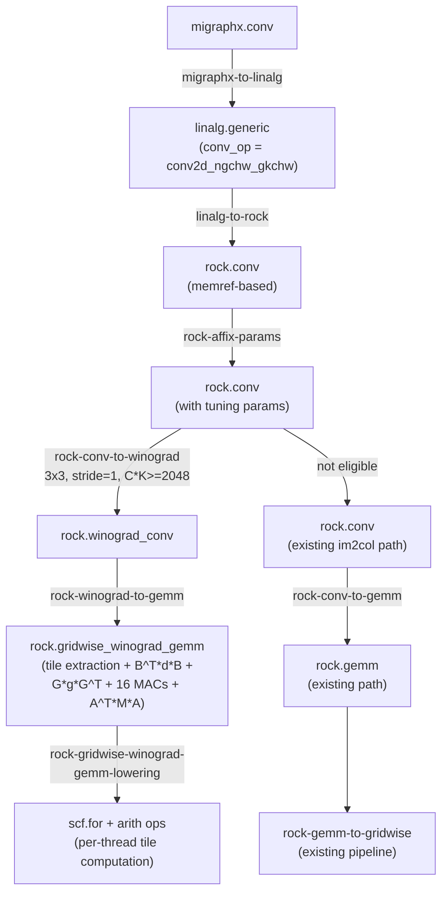
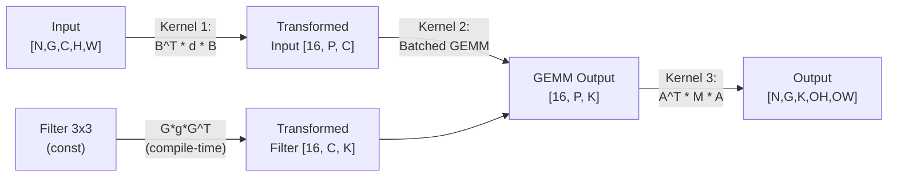

# Winograd Convolution Implementation Plan for rocMLIR

## 1. Overview and Key Decisions

Winograd F(m, r) computes m x m output tiles from (m+r-1) x (m+r-1) input tiles with r x r filters, reducing multiplications by up to 4x. For F(2x2, 3x3), multiplications drop from 36 to 16 (2.25x reduction). The B^T, B, A^T, A transform matrices contain only {-1, 0, 1} entries, so transforms are pure additions/subtractions. The implementation is parameterized by an `fmr` attribute (`F_2_3`, `F_4_3`, `F_2_5`) so different filter sizes can be plugged in later.

### Pipeline Flow



### Kernel Pipeline Ordering

```
rock-affix-params                        <-- populates tuning params
rock-conv-to-winograd                    <-- eligible rock.conv -> rock.winograd_conv
rock-winograd-to-gemm                   <-- rock.winograd_conv -> rock.gridwise_winograd_gemm
rock-gridwise-winograd-gemm-lowering     <-- gridwise op -> scf.for + arith (Winograd kernel)
rock-conv-to-gemm                        <-- remaining non-winograd rock.conv ops
rock-gemm-to-gridwise                    <-- standard GEMM path continues
... (rest unchanged)
```

### Design Decisions

| Decision | Rationale | Source |
|----------|-----------|--------|
| Use `amdgpu.dpp` (not `gpu.shuffle`) | 10x faster, no DS contention | MIOpen, SCALE benchmarks |
| Target F(2,3) only initially | Only fp16-safe variant (condition number ~5) | NOVA, MIOpen |
| Require fp32 accumulation for fp16 input | Transform error amplification (automatic in rocMLIR) | Lavin & Gray, MIOpen |
| Transforms purely in register file via DPP | Enables kernel fusion, zero memory traffic | MIOpen, Tong et al. |
| Minimum C*K heuristic for eligibility | Winograd loses when memory-bound | Zlateski et al. roofline |
| Phase A (3 kernels) before Phase B (fused) | Correctness first; PKF fusion is complex | Engineering judgment |
| Parameterize by `fmr` attribute | General across tile sizes (F_2_3, F_4_3, F_2_5) | Upstream LLVM |
| Run after `rock-affix-params` | Tuning params needed; copies them to `rock.winograd_conv` | Codebase review |
| Use `rock.gemm` `[G]` dim for Winograd batch | `gemmG = merge(alpha2, g)` = `alphaSq * groups`; same pattern as bwd_weight | Codebase review |

### Feasibility (Verified Against Codebase)

**Confirmed working:**
1. Pipeline placement: `rock-affix-params` populates `$params`/`$derivedBlockSize`/`$features` on `rock.conv`. Our pass reads and copies them.
2. `rock.gemm`'s `[G]` dimension works for Winograd batch: `gridSize = (M/mPerBlock) * (N/nPerBlock) * G` scales automatically.
3. fp32 accumulation is automatic: `deduceAccumulatorElementType()` promotes to f32 for any float < 32 bits.
4. DPP modes (`quad_perm`, `row_mirror`, `row_half_mirror`) universally available on GFX9 through GFX12.
5. `BottomUpTMBuilder` API is sufficient: `merge`, `passThrough`, `embed`, `pad`, `unmerge` handle all coordinate-level reshaping.

**Issues requiring attention:**
1. Tuning params may be suboptimal (GEMM K dimension shrinks from `C*9` to `C`). Mitigation: accept for Phase A.
2. `rock.winograd_transform` is a new value-domain op -- first DPP consumer in rocMLIR.
3. Phase A (3 kernels) vs Phase B (fused): start with Phase A at MIGraphX level.
4. DPP lane mapping conflicts with GEMM thread mapping (Phase B only).
5. Avoid GFX9-only DPP modes: `row_bcast_15`, `row_bcast_31`, `wave_*` break on Navi.

### Files to Create/Modify

**New files (implemented):**
- `mlir/include/mlir/Dialect/Rock/IR/WinogradConsts.h` -- transform matrices for F(2,3)
- `mlir/lib/Dialect/Rock/Transforms/ConvToWinograd.cpp` -- eligibility check pass
- `mlir/lib/Dialect/Rock/Transforms/WinogradToGemm.cpp` -- emit gridwise_winograd_gemm
- `mlir/lib/Dialect/Rock/Transforms/GridwiseWinogradGemmLowering.cpp` -- core Winograd kernel
- `mlir/test/Dialect/Rock/conv_to_winograd.mlir` -- 7 pass tests
- `mlir/test/Dialect/Rock/winograd_invalid.mlir` -- 4 verifier tests

**Modified files:**
- [mlir/include/mlir/Dialect/Rock/IR/RockOps.td](mlir/include/mlir/Dialect/Rock/IR/RockOps.td) -- `rock.winograd_conv` + `rock.gridwise_winograd_gemm` ops
- [mlir/include/mlir/Dialect/Rock/Passes.td](mlir/include/mlir/Dialect/Rock/Passes.td) -- 3 new passes
- [mlir/include/mlir/Dialect/Rock/Passes.h](mlir/include/mlir/Dialect/Rock/Passes.h) -- pass declarations
- [mlir/lib/Dialect/Rock/IR/RockDialect.cpp](mlir/lib/Dialect/Rock/IR/RockDialect.cpp) -- verifier + interfaces for both ops
- [mlir/lib/Dialect/Rock/Pipelines/Pipelines.cpp](mlir/lib/Dialect/Rock/Pipelines/Pipelines.cpp) -- all 3 passes in pipeline
- [mlir/lib/Dialect/Rock/Transforms/CMakeLists.txt](mlir/lib/Dialect/Rock/Transforms/CMakeLists.txt) -- 3 new source files

---

## 2. Implementation Plan

### Implementation Status

**Implemented with full Winograd multiply reduction (9 E2E tests passing on gfx942):**

The implementation uses `rock.gridwise_winograd_gemm`, a new op that encapsulates the entire Winograd F(2,3) computation. Each GPU thread processes one 2x2 output tile, performing: 4x4 input tile extraction with padding -> B^T*d*B input transform -> G*g*G^T filter transform (on the fly) -> 16 element-wise multiply-accumulates over channels -> A^T*M*A output transform -> 2x2 output write with bounds checking. This achieves 16 multiplies per 2x2 output tile vs 36 for direct convolution (2.25x reduction).

**Pipeline flow:**
```
rock.conv -> rock.winograd_conv -> rock.gridwise_winograd_gemm -> scf.for + arith ops -> GPU kernel
       (affix-params)  (conv-to-winograd)  (winograd-to-gemm)    (gridwise-winograd-gemm-lowering)
```

Non-eligible convolutions (5x5, stride>1, dilation>1, small C*K) fall through unchanged to `rock-conv-to-gemm`.

**Files:**

| File | Lines | Purpose |
|------|-------|---------|
| `WinogradConsts.h` | 101 | Transform matrices B, B^T, G, G^T, A, A^T for F(2,3) |
| `ConvToWinograd.cpp` | 141 | Eligibility check + rock.conv -> rock.winograd_conv |
| `WinogradToGemm.cpp` | 193 | rock.winograd_conv -> rock.gridwise_winograd_gemm |
| `GridwiseWinogradGemmLowering.cpp` | ~370 | Core kernel: tile loops + transforms + MAC |
| `RockOps.td` changes | ~70 | rock.winograd_conv + rock.gridwise_winograd_gemm ops |
| `RockDialect.cpp` changes | ~100 | Verifier (8 checks) + interfaces |

**Correctness features:**
- fp32 accumulation for fp16 inputs (ExtF/TruncF around all computation)
- Grouped convolution (G>1) verified with G=2,4
- Boundary tile handling (output bounds checking for non-tile-aligned output dims)
- Padding support (symmetric and asymmetric)
- `fmr` parameterization for future tile size extensions

**E2E tests passing `[1 1 1]` on gfx942:**

| Test | Type | Config | Via Winograd? |
|------|------|--------|---------------|
| f32_pad1 | f32 | C=64,K=64,8x8,pad=1 | Yes |
| f32_nopad | f32 | C=64,K=64,8x8,no-pad | Yes |
| f32_resnet | f32 | C=128,K=128,28x28,N=2 | Yes |
| f32_odd7x7 | f32 | C=64,K=64,7x7,pad=1 | Yes |
| f16_pad1 | f16 | C=64,K=64,16x16,pad=1 | Yes (fp32 acc) |
| f32_G2 | f32 | G=2,C=128,K=128,16x16 | Yes |
| f16_G4 | f16 | G=4,C=256,K=256,8x8 | Yes (fp32 acc) |
| stride2_fallback | f32 | stride=2 | No (direct conv) |
| 5x5_fallback | f32 | 5x5 filter | No (direct conv) |

**Lit tests:**
- `conv_to_winograd.mlir`: 7 tests (2 positive, 5 negative) -- FileCheck passes
- `winograd_invalid.mlir`: 4 verifier error tests -- all pass

**Performance gaps (not yet optimized):**

| Gap | Current | Optimal (MIOpen-like) | Impact |
|-----|---------|----------------------|--------|
| GEMM acceleration | Scalar per-thread MAC | MFMA/WMMA matrix instructions | Major: ~10-100x for channel reduction |
| Transform method | Scalar arith ops | DPP butterfly (~10 instructions) | Moderate: fewer instructions, no DS contention |
| Data sharing | Each thread loads independently | LDS tile sharing between threads | Major: reduce global memory bandwidth |
| Filter redundancy | G*g*G^T per thread per channel | Pre-computed once | Moderate: eliminate redundant computation |
| Latency hiding | Sequential execution | Interleave MACs + loads + transforms | Moderate: hide memory latency |
| VGPR budget | Not analyzed | Target < 256 VGPRs/thread | Important for occupancy |

### Performance Optimization Roadmap

To close the performance gaps, the approach is to integrate Winograd transforms into the existing Rock GEMM infrastructure (`GridwiseGemmToBlockwise`). Two approaches will be explored:

**Approach A -- New `GridwiseWinogradGemmRewritePattern`:**
- New pattern modeled on `GridwiseGemmRewritePattern` (lines 317-763 of `GridwiseGemmToBlockwise.cpp`)
- Adds Winograd tile extraction + B^T*d*B after global read, A^T*M*A before global write
- GEMM loop (LDS staging + BlockwiseGemmOp) reused unchanged
- Pros: clean separation, no risk to existing GEMM. Cons: ~500-800 lines, some duplication

**Approach B -- Modify existing `GridwiseGemmRewritePattern`:**
- Add Winograd flag/attribute to `GridwiseGemmOp`
- Insert B^T*d*B after `ThreadwiseReadIntoOp`, A^T*M*A before `ThreadwiseWriteAllOp`
- Pros: less code, full infrastructure reuse. Cons: complexity, regression risk

**Implementation order by impact:**
1. MFMA/WMMA acceleration (biggest win -- route through `rock.gemm` -> `rock.gridwise_gemm`)
2. LDS data sharing (free with gridwise approach)
3. Filter pre-computation (G*g*G^T once per workgroup, not per thread)
4. DPP butterfly transforms (`amdgpu.dpp` with `quad_perm`, `row_mirror`, `row_half_mirror`)
5. Latency hiding (interleave DPP VALU + LDS DS unit + global loads)
6. VGPR budget (<= 256 VGPRs, C16 mode if needed)

**Key files:**
- `GridwiseGemmToBlockwise.cpp` -- new or modified pattern
- `WinogradToGemm.cpp` -- emit `rock.gemm` with proper transform chains
- `GemmToGridwise.cpp` -- handle Winograd-specific GEMM dimensions
- `WinogradConsts.h` -- add DPP coefficient tables
- `GridwiseWinogradGemmLowering.cpp` -- kept as fallback for non-accel architectures

### Phase A: Multi-Kernel MVP (Correctness First)

#### A1. Op Definitions and Pass Registration

- [x] **A1.1** Define `rock.winograd_conv` op in `RockOps.td`
  - Operands: `filter` (pre-transformed `[alphaSq, G, K, C]` memref), `input`, `output`
  - Attributes: `padding`, `strides`, `dilations`, `features`, `params`, `derivedBlockSize`, `gridSize`, `filterPreTransformed` (bool)
  - **`fmr`** attribute: `WinogradConv2DFmr` enum (`F_2_3`, `F_4_3`, `F_2_5`) -- all dimension calculations derive from this, never hardcoded
  - Traits: `DeclareOpInterfaceMethods<RockGemmWrapperInterface>`, `DeclareOpInterfaceMethods<RockGemmFeaturesInterface>`, `DeclareOpInterfaceMethods<MemoryEffectsOpInterface>`, `RockFusionRoot`
  - Layout attributes: `filter_layout`, `input_layout`, `output_layout`
  - Add `WinogradParams getWinogradParams(WinogradConv2DFmr)` helper to compute `{m, r, alpha, alphaSq}` from `fmr`

- [x] **A1.2** Implement `RockGemmWrapperInterface` for `rock.winograd_conv` in `RockDialect.cpp`
  - `getKernelType()` -> `KernelType::Conv`
  - `getGemmSize()` -> `{g = alpha^2 * groups, m = K, k = C, n = N * tileH * tileW}`
  - `getAType/getBType/getCType()` -> element types of filter/input/output
  - `getOutArgument()` -> output operand pointer

- [x] **A1.3** Implement `RockGemmFeaturesInterface` for `rock.winograd_conv`
  - `getTypesForFeature()` -> return filter and input element types

- [x] **A1.4** Add verifier for `rock.winograd_conv` in `RockDialect.cpp`
  - Delegate to `verifyGemmTypes()` for type/arch checks (same as `ConvOp::verify`)
  - Verify `derivedBlockSize` only on accel architectures
  - Verify pre-transformed filter first dim = `alphaSq` (derived from `fmr`, not hardcoded)
  - Verify strides = [1,1], dilations = [1,1]
  - Verify element types in {f32, f16}
  - Verify F_4_3/F_2_5 require f32 (condition number too high for f16)
  - See verifier code and test cases in Section 3

- [x] **A1.5** Register `rock-conv-to-winograd` pass in `Passes.td`
  - `def RockConvToWinogradPass : Pass<"rock-conv-to-winograd", "::mlir::func::FuncOp">`
  - `dependentDialects = ["rock::RockDialect", "memref::MemRefDialect", "arith::ArithDialect"]`

- [x] **A1.6** Register `rock-winograd-to-gemm` pass in `Passes.td`
  - `def RockWinogradToGemmPass : Pass<"rock-winograd-to-gemm", "::mlir::func::FuncOp">`

- [x] **A1.7** Add new source files to `CMakeLists.txt`
  - `mlir/lib/Dialect/Rock/Transforms/ConvToWinograd.cpp`
  - `mlir/lib/Dialect/Rock/Transforms/WinogradToGemm.cpp`

#### A2. `rock-conv-to-winograd` Pass (ConvToWinograd.cpp)

- [x] **A2.1** Implement eligibility check on `rock.conv` ops:
  - Strides = [1,1], dilations = [1,1] (required for all variants)
  - Element type in {f32, f16}
  - `C * K >= 2048` heuristic (configurable via pass option)
  - Forward conv only (not bwd_data or bwd_weight initially)
  - **Select `fmr` variant** from filter size: 3x3 -> `F_2_3`; future: 3x3 + pass option -> `F_4_3`, 5x5 -> `F_2_5`
  - Pass option `--winograd-variants=F_2_3` to control which variants are enabled

- [ ] **A2.2** Implement filter transform const-folding:
  - Walk def chain of filter operand to find `memref.get_global` or constant
  - Look up G matrix from `fmr` variant (table-driven, not hardcoded)
  - Compute `G_fmr * g * G_fmr^T` for each `r x r` filter slice -> `alpha x alpha` pre-transformed filter
  - Create new `memref.global` with shape `[alphaSq, G, K, C]`
  - If filter is not constant, skip Winograd (leave `rock.conv` for ConvToGemm)

- [x] **A2.3** Create `rock.winograd_conv` replacement:
  - Copy `features`, `params`, `derivedBlockSize` from original `rock.conv`
  - Copy `padding`, layout attributes
  - Set `filterPreTransformed = true`
  - Erase original `rock.conv`

- [ ] **A2.4** Create `mlir/test/Dialect/Rock/conv_to_winograd.mlir` (24 test cases, see Section 3)

- [ ] **A2.5** Create `mlir/test/Dialect/Rock/winograd_invalid.mlir` (7 verifier error tests, see Section 3)

#### A3. `rock-winograd-to-gemm` Pass (WinogradToGemm.cpp)

- [ ] **A3.1** Implement input transform chain using `BottomUpTMBuilder`:
  - Read `fmr` from op -> derive `{m, r, alpha, alphaSq}` via `getWinogradParams(fmr)`
  - Step 1: `pad` input spatial dims for tile alignment (ceil to multiple of `m`)
  - Step 2: `embed` overlapping `alpha x alpha` tiles with stride `m`
  - Step 3: `merge` to GEMM dimensions: `[N, G, C, tileH, tileW, alpha, alpha]` -> `[alphaSq*G, C, N*tileH*tileW]`
  - `tileH = ceil(outH / m)`, `tileW = ceil(outW / m)` -- derived from `fmr`

- [ ] **A3.2** Implement filter transform chain:
  - Pre-transformed filter `[alphaSq, G, K, C]` -> `[alphaSq*G, K, C]` via merge

- [ ] **A3.3** Implement output transform chain:
  - GEMM output `[alphaSq*G, K, N*tileH*tileW]` -> unmerge -> `[alphaSq, G, K, N, tileH, tileW]`
  - Then reshape and scatter to spatial output

- [ ] **A3.4** Create `rock.gemm` op:
  - `gemmG = alphaSq * groups` (derived from `fmr`)
  - `gemmM = K`, `gemmK = C`, `gemmN = N * tileH * tileW`
  - Copy `features`, `storeMethod = Set`

- [ ] **A3.5** Handle the value-domain transforms (B^T*d*B and A^T*M*A):
  - **Phase A approach**: emit as separate `linalg.generic` ops
  - **Phase B approach** (future): emit `rock.winograd_transform` ops that lower to DPP

- [ ] **A3.6** Handle grouped convolution correctly:
  - `gemmG = merge(alpha2, g)` with alpha2 as the major dimension
  - Test with G=1, 2, 4, 8

- [ ] **A3.7** Handle boundary tiles:
  - Pad input to align tile grid, clip output to actual dimensions

- [ ] **A3.8** Create `mlir/test/Dialect/Rock/winograd_to_gemm.mlir` (10 test cases, see Section 3)

#### A4. Pipeline Integration

- [x] **A4.1** Insert passes in `Pipelines.cpp` (commented out until lowering complete):
  ```
  funcPm.addPass(rock::createRockAffixTuningParametersPass(...));
  funcPm.addPass(rock::createRockConvToWinogradPass());    // NEW
  funcPm.addPass(rock::createRockWinogradToGemmPass());     // NEW
  funcPm.addPass(rock::createRockConvToGemmPass());
  ```

- [ ] **A4.2** Verify pipeline test (`mlir/test/rocmlir-driver/pipelines.mlir`) still passes

- [x] **A4.3** Add `--rock-conv-to-winograd` to `rocmlir-opt` registration (auto from Passes.td)

#### A5. E2E Accuracy Testing

- [ ] **A5.1** Create manual E2E test: small shape (N=1, C=16, K=16, H=W=8, 3x3, stride=1, pad=1)
  - `rocmlir-gen ... -pv | rocmlir-driver -c | mlir-runner` -> verify `[1 1 1]`
  - f32 first (tighter tolerance), then f16

- [ ] **A5.2** Create E2E tests for boundary cases (odd dims, no padding, non-square, asymmetric padding)

- [ ] **A5.3** Create E2E tests for grouped conv: G=1, G=2, G=4, G=8

- [ ] **A5.4** Create E2E tolerance calibration (f32: `RMS_threshold=0.001`, f16: `RMS_threshold=0.01`)

- [ ] **A5.5** Create `WinogradConvFwd.toml` E2E test suite (see Section 4)

- [ ] **A5.6** Register in `mlir/test/e2e/CMakeLists.txt`

#### A6. Navi (RDNA) Architecture Support

- [ ] **A6.1** Test on RDNA2 (gfx10xx): non-accel GEMM path (scalar FMA), verify correctness
- [ ] **A6.2** Test on RDNA3 (gfx11xx): WMMA GEMM path, wave32, verify correctness
- [ ] **A6.3** Test on RDNA4 (gfx12xx): WMMA GEMM path, verify correctness
- [ ] **A6.4** Test on CDNA (gfx90a/gfx942): MFMA GEMM path, wave64, verify correctness
- [ ] **A6.5** Verify wave32 vs wave64 doesn't affect transform correctness
- [ ] **A6.6** Performance comparison: Winograd vs direct conv on each arch family

### Phase B: Fused Single-Kernel (Performance Optimization)

#### B1. `rock.winograd_transform` Op

- [ ] **B1.1** Define `rock.winograd_transform` op in `RockOps.td`
  - `direction` attribute: `input` (B^T * d * B) or `output` (A^T * M * A)
  - `fmr` attribute: `WinogradConv2DFmr` enum -- determines transform matrix selection and tile sizes
  - Input: tile values (`alphaSq` elements per tile, derived from `fmr`)
  - Output: transformed values (`alphaSq` for input direction, `m*m` for output direction, derived from `fmr`)
  - Transform matrices (B, B^T, A, A^T) stored in a lookup table keyed by `fmr`, not hardcoded

- [ ] **B1.2** Implement lowering pass `LowerWinogradTransform.cpp`
  - Read `fmr` from op -> select appropriate DPP sequence for that tile size
  - For `F_2_3` (alpha=4, fits in 16 lanes): DPP butterfly reduction
  - For `F_4_3`/`F_2_5` (alpha=6, 36 elements): larger DPP sequence or per-thread computation
  - **Avoid**: `row_bcast_15`, `row_bcast_31`, `wave_*` modes (GFX9-only, breaks Navi)

- [ ] **B1.3** Standalone DPP test: verify `amdgpu.dpp` -> `rocdl.dpp_update` -> ISA chain works

#### B2. Fused Kernel Integration

- [ ] **B2.1** Solve DPP lane mapping vs GEMM thread mapping
- [ ] **B2.2** Integrate input transform into GEMM data loading
- [ ] **B2.3** Integrate output transform into GEMM writeback
- [ ] **B2.4** VGPR budget analysis (target: < 256 VGPRs per thread)
- [ ] **B2.5** Instruction interleaving for latency hiding

#### B3. Inline Filter Transform

- [ ] **B3.1** Implement inline G * g * G^T using packed fp16 ops
- [ ] **B3.2** Accuracy test: compare inline filter transform vs const-folded

### Phase C: Production Quality

#### C1. Performance Heuristics

- [ ] **C1.1** Implement applicability cost model (inspired by MIOpen's `ComputeWti`)
- [ ] **C1.2** Tune the `C * K >= 2048` heuristic with benchmarks across architectures
- [ ] **C1.3** Add dimension overflow guards (per MIOpen constraints)

#### C2. Extended Tile Sizes

- [ ] **C2.1** F(4x4, 3x3) support (alpha=6, batch=36, fp32 only)
- [ ] **C2.2** F(2x2, 5x5) support (alpha=6, batch=36, fp32 only)

#### C3. Backward Convolution

- [ ] **C3.1** Backward data: F(3x3, 2x2) with `F_REVERSE_R | F_REVERSE_S`
- [ ] **C3.2** Backward weight: Winograd weight gradient accumulation

#### C4. CI/CD Integration

- [ ] **C4.1** Add Winograd E2E suite to PR CI
- [ ] **C4.2** Add Winograd shapes to nightly performance regression tracking
- [ ] **C4.3** Add accuracy regression detection

---

## 3. Lit Tests and Verifiers

### `rock.winograd_conv` Verifier

Implemented as `WinogradConvOp::verify()` in `RockDialect.cpp`:

```cpp
LogicalResult WinogradConvOp::verify() {
  RockGemmWrapperInterface gemmOp = cast<RockGemmWrapperInterface>(*this);
  if (failed(verifyGemmTypes(gemmOp)))
    return failure();

  StringAttr arch = rock::getArchValue(gemmOp);
  rock::AmdArchInfo archInfo = rock::lookupArchInfo(arch);
  bool isAccel = archInfo.isAccel(gemmOp);
  if (gemmOp.getDerivedBlockSize().has_value() && !isAccel)
    return emitOpError("general kernels shouldn't have derived block size.");

  // Derive alpha^2 from the fmr attribute (not hardcoded)
  WinogradParams wp = getWinogradParams(getFmr());

  // Pre-transformed filter: first dim must be alpha^2
  auto filterType = cast<ShapedType>(getFilter().getType());
  ArrayRef<int64_t> filterShape = filterType.getShape();
  if (getFilterPreTransformed()) {
    if (filterShape[0] != wp.alphaSq)
      return emitOpError("pre-transformed filter must have first dim = alpha^2 = ")
             << wp.alphaSq << " for " << stringifyWinogradConv2DFmr(getFmr())
             << ", got " << filterShape[0];
  }

  // Strides must be [1, 1] (required for all Winograd variants)
  auto strides = getStrides();
  for (auto s : strides)
    if (s != 1)
      return emitOpError("Winograd requires stride=1, got ") << s;

  // Dilations must be [1, 1]
  auto dilations = getDilations();
  for (auto d : dilations)
    if (d != 1)
      return emitOpError("Winograd requires dilation=1, got ") << d;

  // Element type must be f32 or f16
  Type elemType = filterType.getElementType();
  if (!elemType.isF32() && !elemType.isF16())
    return emitOpError("Winograd currently supports f32 and f16 only, got ") << elemType;

  // F_4_3 and F_2_5 require f32 (condition number too high for f16)
  if (getFmr() != WinogradConv2DFmr::F_2_3 && elemType.isF16())
    return emitOpError("Winograd ") << stringifyWinogradConv2DFmr(getFmr())
           << " requires f32 (condition number too high for f16)";

  return success();
}
```

| Check | Error message | Catches |
|-------|--------------|---------|
| Type compatibility | "floating-point input requires floating-point output" | Mixed int/float |
| WMMA/MFMA type support | arch-specific type errors | Unsupported dtypes on arch |
| `derivedBlockSize` on non-accel | "general kernels shouldn't have derived block size" | Param misconfiguration |
| Pre-transformed filter dim | "pre-transformed filter must have first dim = alpha^2 = N" | Wrong filter shape (N from `fmr`) |
| Stride != 1 | "Winograd requires stride=1" | Ineligible conv |
| Dilation != 1 | "Winograd requires dilation=1" | Ineligible conv |
| Unsupported element type | "Winograd currently supports f32 and f16 only" | bf16, i8, fp8 |
| F_4_3/F_2_5 with f16 | "Winograd F_4_3 requires f32" | Numerically unsafe variant |

### Verifier Lit Tests (`mlir/test/Dialect/Rock/winograd_invalid.mlir`)

```mlir
// RUN: rocmlir-opt %s -split-input-file -verify-diagnostics

// -----

// Test: F_2_3 pre-transformed filter with wrong alpha^2 dimension (9 != 16)
func.func @winograd_conv_bad_filter_dim(
    %filter: memref<9x1x128x64xf16>,
    %input: memref<1x1x64x32x32xf16>,
    %output: memref<1x1x128x30x30xf16>
) attributes {arch = "amdgcn-amd-amdhsa:gfx942", kernel} {
  // expected-error@+1 {{'rock.winograd_conv' op pre-transformed filter must have first dim = alpha^2 = 16 for F_2_3, got 9}}
  rock.winograd_conv(%filter, %input, %output) features = mfma {
    filter_layout = ["gemmG", "g", "k", "c"],
    input_layout = ["ni", "gi", "ci", "0i", "1i"],
    output_layout = ["no", "go", "ko", "0o", "1o"],
    dilations = [1 : index, 1 : index],
    strides = [1 : index, 1 : index],
    padding = [1 : index, 1 : index, 1 : index, 1 : index],
    filterPreTransformed = true,
    fmr = F_2_3
  } : memref<9x1x128x64xf16>, memref<1x1x64x32x32xf16>, memref<1x1x128x30x30xf16>
  return
}

// -----

// Test: F_4_3 pre-transformed filter with wrong alpha^2 dimension (16 != 36)
func.func @winograd_conv_bad_filter_dim_f43(
    %filter: memref<16x1x128x64xf32>,
    %input: memref<1x1x64x32x32xf32>,
    %output: memref<1x1x128x30x30xf32>
) attributes {arch = "amdgcn-amd-amdhsa:gfx942", kernel} {
  // expected-error@+1 {{'rock.winograd_conv' op pre-transformed filter must have first dim = alpha^2 = 36 for F_4_3, got 16}}
  rock.winograd_conv(%filter, %input, %output) features = mfma {
    filter_layout = ["gemmG", "g", "k", "c"],
    input_layout = ["ni", "gi", "ci", "0i", "1i"],
    output_layout = ["no", "go", "ko", "0o", "1o"],
    dilations = [1 : index, 1 : index],
    strides = [1 : index, 1 : index],
    padding = [1 : index, 1 : index, 1 : index, 1 : index],
    filterPreTransformed = true,
    fmr = F_4_3
  } : memref<16x1x128x64xf32>, memref<1x1x64x32x32xf32>, memref<1x1x128x30x30xf32>
  return
}

// -----

// Test: F_4_3 with f16 is rejected (condition number too high)
func.func @winograd_conv_f43_f16_rejected(
    %filter: memref<36x1x128x64xf16>,
    %input: memref<1x1x64x32x32xf16>,
    %output: memref<1x1x128x30x30xf16>
) attributes {arch = "amdgcn-amd-amdhsa:gfx942", kernel} {
  // expected-error@+1 {{'rock.winograd_conv' op Winograd F_4_3 requires f32 (condition number too high for f16)}}
  rock.winograd_conv(%filter, %input, %output) features = mfma {
    filter_layout = ["gemmG", "g", "k", "c"],
    input_layout = ["ni", "gi", "ci", "0i", "1i"],
    output_layout = ["no", "go", "ko", "0o", "1o"],
    dilations = [1 : index, 1 : index],
    strides = [1 : index, 1 : index],
    padding = [0 : index, 0 : index, 0 : index, 0 : index],
    filterPreTransformed = true,
    fmr = F_4_3
  } : memref<36x1x128x64xf16>, memref<1x1x64x32x32xf16>, memref<1x1x128x30x30xf16>
  return
}

// -----

// Test: stride != 1 is rejected
func.func @winograd_conv_bad_stride(
    %filter: memref<16x1x128x64xf16>,
    %input: memref<1x1x64x32x32xf16>,
    %output: memref<1x1x128x15x15xf16>
) attributes {arch = "amdgcn-amd-amdhsa:gfx942", kernel} {
  // expected-error@+1 {{'rock.winograd_conv' op Winograd requires stride=1}}
  rock.winograd_conv(%filter, %input, %output) features = mfma {
    filter_layout = ["gemmG", "g", "k", "c"],
    input_layout = ["ni", "gi", "ci", "0i", "1i"],
    output_layout = ["no", "go", "ko", "0o", "1o"],
    dilations = [1 : index, 1 : index],
    strides = [2 : index, 2 : index],
    padding = [0 : index, 0 : index, 0 : index, 0 : index],
    filterPreTransformed = true,
    fmr = F_2_3
  } : memref<16x1x128x64xf16>, memref<1x1x64x32x32xf16>, memref<1x1x128x15x15xf16>
  return
}

// -----

// Test: dilation != 1 is rejected
func.func @winograd_conv_bad_dilation(
    %filter: memref<16x1x128x64xf16>,
    %input: memref<1x1x64x32x32xf16>,
    %output: memref<1x1x128x28x28xf16>
) attributes {arch = "amdgcn-amd-amdhsa:gfx942", kernel} {
  // expected-error@+1 {{'rock.winograd_conv' op Winograd requires dilation=1}}
  rock.winograd_conv(%filter, %input, %output) features = mfma {
    filter_layout = ["gemmG", "g", "k", "c"],
    input_layout = ["ni", "gi", "ci", "0i", "1i"],
    output_layout = ["no", "go", "ko", "0o", "1o"],
    dilations = [2 : index, 2 : index],
    strides = [1 : index, 1 : index],
    padding = [0 : index, 0 : index, 0 : index, 0 : index],
    filterPreTransformed = true,
    fmr = F_2_3
  } : memref<16x1x128x64xf16>, memref<1x1x64x32x32xf16>, memref<1x1x128x28x28xf16>
  return
}

// -----

// Test: unsupported element type (bf16) is rejected
func.func @winograd_conv_bad_dtype(
    %filter: memref<16x1x128x64xbf16>,
    %input: memref<1x1x64x32x32xbf16>,
    %output: memref<1x1x128x30x30xbf16>
) attributes {arch = "amdgcn-amd-amdhsa:gfx942", kernel} {
  // expected-error@+1 {{'rock.winograd_conv' op Winograd currently supports f32 and f16 only}}
  rock.winograd_conv(%filter, %input, %output) features = mfma {
    filter_layout = ["gemmG", "g", "k", "c"],
    input_layout = ["ni", "gi", "ci", "0i", "1i"],
    output_layout = ["no", "go", "ko", "0o", "1o"],
    dilations = [1 : index, 1 : index],
    strides = [1 : index, 1 : index],
    padding = [1 : index, 1 : index, 1 : index, 1 : index],
    filterPreTransformed = true,
    fmr = F_2_3
  } : memref<16x1x128x64xbf16>, memref<1x1x64x32x32xbf16>, memref<1x1x128x30x30xbf16>
  return
}

// -----

// Test: float input with integer output is rejected (from verifyGemmTypes)
func.func @winograd_conv_type_mismatch(
    %filter: memref<16x1x128x64xf16>,
    %input: memref<1x1x64x32x32xf16>,
    %output: memref<1x1x128x30x30xi32>
) attributes {arch = "amdgcn-amd-amdhsa:gfx942", kernel} {
  // expected-error@+1 {{'rock.winograd_conv' op floating-point input type}}
  rock.winograd_conv(%filter, %input, %output) features = mfma {
    filter_layout = ["gemmG", "g", "k", "c"],
    input_layout = ["ni", "gi", "ci", "0i", "1i"],
    output_layout = ["no", "go", "ko", "0o", "1o"],
    dilations = [1 : index, 1 : index],
    strides = [1 : index, 1 : index],
    padding = [1 : index, 1 : index, 1 : index, 1 : index],
    filterPreTransformed = true,
    fmr = F_2_3
  } : memref<16x1x128x64xf16>, memref<1x1x64x32x32xf16>, memref<1x1x128x30x30xi32>
  return
}
```

### Pass Lit Tests: `conv_to_winograd.mlir`

Coverage matrix:

| Category | Tests | What's checked |
|----------|-------|---------------|
| **Architectures** | gfx906, gfx90a, gfx942, gfx1030, gfx1100, gfx1201 | All arch families |
| **Data types** | f16, f32 | Both supported types |
| **Problem sizes** | Small, Large, Odd dims, Non-square, Large batch | Tile boundary handling |
| **Layouts** | NCHW, NHWC | Layout-agnostic |
| **Groups** | G=1, G=2, G=4, G=8 | Grouped conv |
| **Padding** | None, Symmetric, Asymmetric | Padding propagation |
| **Negative** | 5x5, 7x7, 1x1, 3x1 filters; stride=2; dilation=2; asymmetric stride | Fallthrough |

Full test file: see `mlir/test/Dialect/Rock/conv_to_winograd.mlir` specification in the original plan's lit test section. The test uses:
```
// RUN: rocmlir-opt --rock-affix-params --rock-conv-to-winograd --mlir-print-local-scope --split-input-file %s | FileCheck %s
```

Positive tests check `// CHECK: rock.winograd_conv` and `// CHECK-NOT: rock.conv`.
Negative tests check `// CHECK: rock.conv` and `// CHECK-NOT: rock.winograd_conv`.

### Pass Lit Tests: `winograd_to_gemm.mlir`

Coverage matrix:

| Category | Tests | What's checked |
|----------|-------|---------------|
| **Arch/dtype** | f16/gfx942 (MFMA), f32/gfx906 (non-accel), f16/gfx1100 (WMMA) | All accel families |
| **Groups** | G=4 -> gemmG = 64 | Batch dimension |
| **Problem sizes** | Odd dims 7x7, Non-square 8x32, Large batch N=64 | Tile grid |
| **Padding** | Asymmetric | Pad transform |

Full test file: see `mlir/test/Dialect/Rock/winograd_to_gemm.mlir` specification in the original plan's lit test section. The test uses:
```
// RUN: rocmlir-opt --rock-winograd-to-gemm --mlir-print-local-scope --split-input-file %s | FileCheck %s
```

All tests verify: `rock.transform` chain present, `rock.gemm` present, `rock.winograd_conv` absent.

---

## 4. E2E Accuracy Testing

End-to-end accuracy testing validates that the Winograd path produces numerically correct results using `rocmlir-gen` + `rocmlir-driver -c` + `mlir-runner` + `libconv-validation-wrappers`.

### Verification Pipeline

```bash
rocmlir-gen --arch <arch> --operation conv <shape-flags> -t <dtype> -pv \
  [-rand 1 -rand_type float] [-RMS_threshold <thr>] [-relDiff_threshold <thr>] \
  | rocmlir-driver -c \
  | mlir-runner -O2 \
      --shared-libs=libmlir_rocm_runtime,libconv-validation-wrappers,libmlir_runner_utils,libmlir_float16_utils \
      --entry-point-result=void \
  | FileCheck --check-prefix=CHECK
```

- `-pv` generates a CPU reference path; result `[1 1 1]` = all metrics pass
- `-pv_with_gpu` compares GPU Winograd against GPU direct conv

### Tolerance Thresholds

| Data type | Direct conv RMS | Winograd RMS (expected) | Recommended `-RMS_threshold` |
|-----------|-----------------|-------------------------|------------------------------|
| f32       | ~1e-6           | ~1e-5                   | 0.001                        |
| f16       | ~1e-3           | ~1e-2                   | 0.01                         |

### TOML E2E Test Suite: `WinogradConvFwd.toml`

Create `mlir/test/e2e/WinogradConvFwd.toml`:

```toml
directory = "WinogradConvFwd"
prefix = "rocmlir-gen"
suffix = "-rand 1 -rand_type float -RMS_threshold 0.001 --arch %arch %pv %random_data %rocmlir_gen_flags | rocmlir-driver -c | mlir-runner -O2 --shared-libs=%linalg_test_lib_dir/libmlir_rocm_runtime%shlibext,%conv_validation_wrapper_library_dir/libconv-validation-wrappers%shlibext,%linalg_test_lib_dir/libmlir_runner_utils%shlibext,%linalg_test_lib_dir/libmlir_float16_utils%shlibext --entry-point-result=void | FileCheck %s --check-prefix="

[[axis]]
name = "operation"
values = ["conv"]
prefix = "--operation "

[[axis]]
name = "layout"
values = ["-fil_layout=gkcyx -in_layout=ngchw -out_layout=ngkhw", "-fil_layout=gkyxc -in_layout=nhwgc -out_layout=nhwgk"]

[[axis]]
name = "data type"
values = ["f32", "f16"]
prefix = "-t "

[[suite]]
name = "config"

# Small shapes (quick smoke tests)
[[suite.test]]
config = "-groupsize=1 -batchsize=1 -in_channels=4 -out_channels=8 -in_h=8 -in_w=8 -fil_h=3 -fil_w=3 -dilation_h=1 -dilation_w=1 -conv_stride_h=1 -conv_stride_w=1 -padding_h_l=1 -padding_h_r=1 -padding_w_l=1 -padding_w_r=1"

[[suite.test]]
config = "-groupsize=1 -batchsize=1 -in_channels=16 -out_channels=16 -in_h=8 -in_w=8 -fil_h=3 -fil_w=3 -dilation_h=1 -dilation_w=1 -conv_stride_h=1 -conv_stride_w=1 -padding_h_l=0 -padding_h_r=0 -padding_w_l=0 -padding_w_r=0"

# Medium shapes (ResNet-like)
[[suite.test]]
config = "-groupsize=1 -batchsize=64 -in_channels=64 -out_channels=64 -in_h=56 -in_w=56 -fil_h=3 -fil_w=3 -dilation_h=1 -dilation_w=1 -conv_stride_h=1 -conv_stride_w=1 -padding_h_l=1 -padding_h_r=1 -padding_w_l=1 -padding_w_r=1"

[[suite.test]]
config = "-groupsize=1 -batchsize=64 -in_channels=128 -out_channels=128 -in_h=28 -in_w=28 -fil_h=3 -fil_w=3 -dilation_h=1 -dilation_w=1 -conv_stride_h=1 -conv_stride_w=1 -padding_h_l=1 -padding_h_r=1 -padding_w_l=1 -padding_w_r=1"

[[suite.test]]
config = "-groupsize=1 -batchsize=64 -in_channels=256 -out_channels=256 -in_h=14 -in_w=14 -fil_h=3 -fil_w=3 -dilation_h=1 -dilation_w=1 -conv_stride_h=1 -conv_stride_w=1 -padding_h_l=1 -padding_h_r=1 -padding_w_l=1 -padding_w_r=1"

# Large shapes (stress test)
[[suite.test]]
config = "-groupsize=1 -batchsize=1 -in_channels=256 -out_channels=512 -in_h=64 -in_w=64 -fil_h=3 -fil_w=3 -dilation_h=1 -dilation_w=1 -conv_stride_h=1 -conv_stride_w=1 -padding_h_l=1 -padding_h_r=1 -padding_w_l=1 -padding_w_r=1"

# Odd spatial dims
[[suite.test]]
config = "-groupsize=1 -batchsize=1 -in_channels=16 -out_channels=32 -in_h=7 -in_w=7 -fil_h=3 -fil_w=3 -dilation_h=1 -dilation_w=1 -conv_stride_h=1 -conv_stride_w=1 -padding_h_l=1 -padding_h_r=1 -padding_w_l=1 -padding_w_r=1"

[[suite.test]]
config = "-groupsize=1 -batchsize=1 -in_channels=16 -out_channels=32 -in_h=13 -in_w=13 -fil_h=3 -fil_w=3 -dilation_h=1 -dilation_w=1 -conv_stride_h=1 -conv_stride_w=1 -padding_h_l=0 -padding_h_r=0 -padding_w_l=0 -padding_w_r=0"

# No padding
[[suite.test]]
config = "-groupsize=1 -batchsize=4 -in_channels=32 -out_channels=64 -in_h=16 -in_w=16 -fil_h=3 -fil_w=3 -dilation_h=1 -dilation_w=1 -conv_stride_h=1 -conv_stride_w=1 -padding_h_l=0 -padding_h_r=0 -padding_w_l=0 -padding_w_r=0"

# Grouped convolution
[[suite.test]]
config = "-groupsize=2 -batchsize=4 -in_channels=32 -out_channels=64 -in_h=16 -in_w=16 -fil_h=3 -fil_w=3 -dilation_h=1 -dilation_w=1 -conv_stride_h=1 -conv_stride_w=1 -padding_h_l=1 -padding_h_r=1 -padding_w_l=1 -padding_w_r=1"

[[suite.test]]
config = "-groupsize=4 -batchsize=4 -in_channels=32 -out_channels=64 -in_h=16 -in_w=16 -fil_h=3 -fil_w=3 -dilation_h=1 -dilation_w=1 -conv_stride_h=1 -conv_stride_w=1 -padding_h_l=1 -padding_h_r=1 -padding_w_l=1 -padding_w_r=1"

[[suite.test]]
config = "-groupsize=8 -batchsize=2 -in_channels=64 -out_channels=64 -in_h=8 -in_w=8 -fil_h=3 -fil_w=3 -dilation_h=1 -dilation_w=1 -conv_stride_h=1 -conv_stride_w=1 -padding_h_l=1 -padding_h_r=1 -padding_w_l=1 -padding_w_r=1"

# Asymmetric padding
[[suite.test]]
config = "-groupsize=1 -batchsize=2 -in_channels=16 -out_channels=32 -in_h=10 -in_w=10 -fil_h=3 -fil_w=3 -dilation_h=1 -dilation_w=1 -conv_stride_h=1 -conv_stride_w=1 -padding_h_l=1 -padding_h_r=0 -padding_w_l=0 -padding_w_r=1"

# Non-square spatial dims
[[suite.test]]
config = "-groupsize=1 -batchsize=4 -in_channels=32 -out_channels=64 -in_h=8 -in_w=32 -fil_h=3 -fil_w=3 -dilation_h=1 -dilation_w=1 -conv_stride_h=1 -conv_stride_w=1 -padding_h_l=1 -padding_h_r=1 -padding_w_l=1 -padding_w_r=1"
```

### Running E2E Tests

```bash
cmake -DROCK_E2E_TEST_ENABLED=ON ...
cd build && ctest -R WinogradConvFwd

# Manual single-config test
rocmlir-gen --arch gfx942 --operation conv \
  -groupsize=1 -batchsize=1 -in_channels=64 -out_channels=64 \
  -in_h=56 -in_w=56 -fil_h=3 -fil_w=3 \
  -dilation_h=1 -dilation_w=1 -conv_stride_h=1 -conv_stride_w=1 \
  -padding_h_l=1 -padding_h_r=1 -padding_w_l=1 -padding_w_r=1 \
  -t f16 -pv -rand 1 -rand_type float -RMS_threshold 0.01 \
  | rocmlir-driver -c \
  | mlir-runner -O2 \
      --shared-libs=libmlir_rocm_runtime,libconv-validation-wrappers,libmlir_runner_utils,libmlir_float16_utils \
      --entry-point-result=void
# Expected: [1 1 1]
```

---

## 5. Technical Reference

### Algorithm

Winograd F(2x2, 3x3) has 4 phases:

1. **Filter transform**: `U = G * g * G^T` (3x3 -> 4x4, precomputable at compile time)
2. **Input transform**: `V = B^T * d * B` (4x4 tile -> 4x4 transformed, additions only)
3. **Batched GEMM**: `M = U * V` (reduction over channels, `alpha^2` independent matmuls)
4. **Output transform**: `Y = A^T * M * A` (4x4 -> 2x2 output tile, additions only)

The `fmr` attribute determines all constants:

| `fmr` | `m` (output tile) | `r` (filter size) | `alpha = m+r-1` | `alpha^2` (batch) |
|-------|-------------------|-------------------|-----------------|-------------------|
| `F_2_3` | 2 | 3 | 4 | 16 |
| `F_4_3` | 4 | 3 | 6 | 36 |
| `F_2_5` | 2 | 5 | 6 | 36 |

Helper:

```cpp
struct WinogradParams {
  int64_t m;      // output tile size
  int64_t r;      // filter size
  int64_t alpha;  // m + r - 1 (transform domain size)
  int64_t alphaSq; // alpha * alpha (GEMM batch dimension)
};

WinogradParams getWinogradParams(WinogradConv2DFmr fmr) {
  auto [m, r] = getFmrFromWinogradConv2DFmr(fmr);
  int64_t alpha = m + r - 1;
  return {m, r, alpha, alpha * alpha};
}
```

### Symbolic Formulas (F(2,3))

**Input transform V = B^T * d * B**:

```
BT = [-1  0  1  0]     B = [-1  0  0  0]
     [ 0 -1  1  0]         [ 0 -1  1 -1]
     [ 0  1  1  0]         [ 1  1  1  0]
     [ 0 -1  0  1]         [ 0  0  0  1]

Fully expanded:
  V[0][0] =  d[0][0] - d[0][2] - d[2][0] + d[2][2]
  V[0][1] =  d[0][1] - d[0][2] - d[2][1] + d[2][2]
  V[0][2] = -d[0][1] - d[0][2] + d[2][1] + d[2][2]
  V[0][3] =  d[0][1] - d[0][3] - d[2][1] + d[2][3]
  V[1][0] =  d[1][0] - d[1][2] - d[2][0] + d[2][2]
  V[1][1] =  d[1][1] - d[1][2] - d[2][1] + d[2][2]
  V[1][2] = -d[1][1] - d[1][2] + d[2][1] + d[2][2]
  V[1][3] =  d[1][1] - d[1][3] - d[2][1] + d[2][3]
  V[2][0] = -d[1][0] + d[1][2] - d[2][0] + d[2][2]
  V[2][1] = -d[1][1] + d[1][2] - d[2][1] + d[2][2]
  V[2][2] =  d[1][1] + d[1][2] + d[2][1] + d[2][2]
  V[2][3] = -d[1][1] + d[1][3] - d[2][1] + d[2][3]
  V[3][0] =  d[1][0] - d[1][2] - d[3][0] + d[3][2]
  V[3][1] =  d[1][1] - d[1][2] - d[3][1] + d[3][2]
  V[3][2] = -d[1][1] - d[1][2] + d[3][1] + d[3][2]
  V[3][3] =  d[1][1] - d[1][3] - d[3][1] + d[3][3]
```

**Output transform Y = A^T * M * A**:

```
AT = [1  1  1  0]     A = [1  0]
     [0 -1  1  1]         [1 -1]
                           [1  1]
                           [0  1]

Fully expanded:
  Y[0][0] =  M[0][0] + M[0][1] + M[0][2] + M[1][0] + M[1][1] + M[1][2] + M[2][0] + M[2][1] + M[2][2]
  Y[0][1] = -M[0][1] + M[0][2] + M[0][3] - M[1][1] + M[1][2] + M[1][3] - M[2][1] + M[2][2] + M[2][3]
  Y[1][0] = -M[1][0] - M[1][1] - M[1][2] + M[2][0] + M[2][1] + M[2][2] + M[3][0] + M[3][1] + M[3][2]
  Y[1][1] =  M[1][1] - M[1][2] - M[1][3] - M[2][1] + M[2][2] + M[2][3] - M[3][1] + M[3][2] + M[3][3]
```

**Filter transform G matrix** for F(2,3):

```
G = [-1    0    0  ]
    [1/2  -1/2  1/2]
    [1/2   1/2  1/2]
    [ 0    0    1  ]
```

### Op Definitions

#### `rock.winograd_conv`

- Operands: `filter` (pre-transformed `[alphaSq, G, K, C]`), `input`, `output`
- Attributes: `filter_layout`, `input_layout`, `output_layout`, `padding`, `strides`, `dilations`, `features`, `params`, `derivedBlockSize`, `gridSize`, `filterPreTransformed`, `fmr`
- Implements `RockGemmWrapperInterface` (6 mandatory methods -- see Section 2, A1.2)
- Implements `RockGemmFeaturesInterface`, carries `RockFusionRoot` trait

#### `rock.winograd_transform`

- Value-domain transform (B^T * d * B or A^T * M * A)
- Attributes: `direction` (input or output), `fmr` (determines transform matrices from lookup table)
- Input: `alphaSq` elements per tile; Output: `alphaSq` (input dir) or `m*m` (output dir)
- Lowering: `amdgpu.dpp` butterfly for F_2_3 (alpha=4); per-thread for F_4_3/F_2_5 (alpha=6)

### Data Flow (Single Kernel)

```
Input [N, G, C, H, W]
  |-> (1) rock.transform [Pad]: align to tile grid
  |-> (2) rock.transform [Embed]: extract alpha x alpha tiles with stride m
  |-> (3) rock.winograd_transform(input): B^T * d * B
  |-> (4) rock.transform [Merge]: reshape to [alphaSq*G, C, N*tileH*tileW]
  |-> (5) rock.gemm (batched, gemmG = alphaSq * groups)
  |-> (6) rock.transform [Unmerge]: reshape back to tiles
  |-> (7) rock.winograd_transform(output): A^T * M * A
  |-> (8) rock.transform [Embed + Merge]: scatter m x m tiles to output
  => Output [N, G, K, OH, OW]
```

`rock.gemm`'s `[G]` dimension is used for the Winograd batch: `gemmG = merge(alpha2, g)` = `alphaSq * groups`. Grid size scales automatically.

### What `rock.transform` CAN and CANNOT Do

| Transform | Semantics | Winograd use? |
|-----------|-----------|---------------|
| **PassThrough** | `lower[i] = upper[i]` | Yes -- pass batch/channel dims |
| **Pad** | `lower[i] = upper[i] - leftPad` | Yes -- pad spatial dims for tile alignment |
| **Embed** | `lower = coeff[i] * upper[i]` (coordinates) | Yes -- extract overlapping tiles |
| **Merge** | Pack multiple lower dims into one upper dim | Yes -- merge to gemmN |
| **Unmerge** | Unpack one lower dim to multiple upper dims | Yes -- reshape for batching |

**Key finding**: No transform expresses value-domain operations (sums/differences of tensor elements). The Winograd transforms (B^T * d * B, A^T * M * A) require `rock.winograd_transform`.

### DPP Transforms (MIOpen Reference)

MIOpen's production kernel uses DPP butterfly reductions for the output transform:

```asm
// Stage 1: quad_perm swap pairs, multiply by sign coefficients (+1/-1)
v_fmac_f32_dpp v6, v6, v179 quad_perm:[2,3,0,1] row_mask:0xf bank_mask:0xc

// Stage 2: row_mirror -- add across 8-lane half-rows
v_add_f32_dpp v5, v6, v5 row_mirror row_mask:0xf bank_mask:0xf

// Stage 3: quad_perm swap adjacent, multiply by sign coefficients
v_fmac_f32_dpp v5, v5, v180 quad_perm:[1,0,3,2] row_mask:0xf bank_mask:0x6

// Stage 4: row_half_mirror -- add across 4-lane quarter-rows
v_add_f32_dpp v4, v5, v4 row_half_mirror row_mask:0xf bank_mask:0xf

// Stage 5: final scaling
v_mul_f32_e32 v4, 0.5, v4
```

| DPP Mode | What it does | Winograd role |
|----------|-------------|---------------|
| `quad_perm:[2,3,0,1]` | Swap lane pairs within 4-lane quads | A^T/B^T row operations |
| `quad_perm:[1,0,3,2]` | Swap adjacent lanes within quads | A/B column operations |
| `row_mirror` | Mirror across 8-lane half-rows | Butterfly reduction stage 2 |
| `row_half_mirror` | Mirror across 4-lane quarter-rows | Butterfly reduction stage 4 |

All needed modes are universally available (GFX9-GFX12). Avoid `row_bcast_15`/`row_bcast_31`/`wave_*` (GFX9-only).

### Architecture Support

| Architecture | Family | Wave size | GEMM accel | DPP16 |
|-------------|--------|-----------|------------|-------|
| gfx906 | CDNA (Vega) | 64 | none (dot) | yes |
| gfx908/90a/942/950 | CDNA (MI-series) | 64 | MFMA | yes |
| gfx1010/1012/103x | RDNA2 (Navi2) | 32 | none | yes |
| gfx11xx | RDNA3 (Navi3) | 32 | WMMA | yes |
| gfx12xx | RDNA4 | 32 | WMMA | yes |

- DPP butterfly operates **within a 16-lane row**, independent of wave size (wave32: 2 tiles/wavefront, wave64: 4 tiles/wavefront)
- GEMM acceleration selected automatically by `AccelEmitter::select()` based on `GemmFeatures`
- fp32 accumulation automatic for f16 inputs via `deduceAccumulatorElementType()`

### Performance Findings

**References:**
- [Lavin & Gray 2015](https://arxiv.org/abs/1509.09308) -- foundational Winograd CNN paper
- [NOVA 2025](https://arxiv.org/abs/2512.18453) -- numerical conditioning analysis
- [Tong et al. 2022](https://link.springer.com/chapter/10.1007/978-3-031-21395-3_2) -- partial kernel fusion (8-13x over cuDNN)
- [Zlateski et al. 2018](https://mlsys.org/Conferences/doc/2018/28.pdf) -- roofline analysis
- MIOpen [Conv_Winograd_v40_6_0](https://github.com/ROCm/rocm-libraries/blob/develop/projects/miopen/src/kernels/Conv_Winograd_v40_6_0_gfx12_fp16_dot2_f2x3_stride1.inc) (~11K lines assembly)

**Key findings:**

1. **Roofline breakeven**: Winograd profitable when `C * K >= ~2048` (compute-bound). Loses when memory-bound (small C/K).

2. **DPP is 10x faster than DS permute**: Use `amdgpu.dpp` exclusively, never `gpu.shuffle` / `ds_bpermute`. Zero DS unit contention means transforms can overlap with LDS traffic.

3. **Register-based transforms enable fusion**: Input/output transforms ~10 DPP instructions each, entirely in registers. Partial kernel fusion [Tong et al.] achieves 8-13x over cuDNN.

4. **Numerical conditioning limits tile size**: F(2,3) condition number ~5 (fp16 safe). F(4,3) ~200 (fp32 only). F(6,3) ~10,000 (unsafe).

5. **VGPR budget ~256 per thread**: GEMM accumulators (~128), tile data (~32), filter (~32), temps (~16), addresses (~16), signs (~2). C16/C32 mode split for VGPR management.

6. **Latency hiding**: Interleave GEMM MACs + LDS loads + filter transform across VALU/DS/global units.

### MIOpen Lessons

From [conv_wino_fury_RxS.cpp](https://github.com/ROCm/rocm-libraries/blob/develop/projects/miopen/src/solver/conv/conv_wino_fury_RxS.cpp) and [Issue #4998](https://github.com/ROCm/rocm-libraries/issues/4998):

- **Grouped conv bug**: Grid size not multiplied by G, only 1 of G groups computed. Ensure grid covers all groups.
- **Stale output values**: Initialize output buffer or ensure all elements written.
- **Applicability**: fp16 only, stride=1, dilation=1, filter<=3x3, packed tensors, gfx11/gfx12 only.
- **Overflow guards**: N/G/C/K/H/W < 2^16, index spaces < 2^28/2^31.
- **Workgroup config**: 256 threads, 65KB LDS, 256 VGPRs, wave64 forced on RDNA.

### Risks and Mitigations

| Risk | MIOpen evidence | Mitigation |
|------|----------------|------------|
| Grouped conv off-by-one | Issue #4998 | Test G=1,2,4,8 |
| Numerical accuracy (fp16) | fp32 accumulation required | Automatic in rocMLIR |
| VGPR pressure | 256 VGPRs, C16/C32 split | Start with C16-equivalent |
| Output tile boundary | oW < 2^16 - 3 | Handle partial tiles |
| Architecture portability | MIOpen: gfx11/gfx12 only | DPP transforms arch-agnostic |
| Performance regression | Winograd slower for small C/K | Applicability heuristic |

### Lessons from Implementation Attempt

1. **Pipeline ordering**: Must run after `rock-affix-params` (tuning params needed), before `rock-conv-to-gemm` (fallthrough). Matches on `rock.conv` (memref-based).
2. **Single-kernel limitation**: Kernel pipeline expects single function. Phase A uses separate kernels; Phase B fuses.
3. **Grouped conv correctness**: `gemmG = alpha^2 * G` with per-group independent matmuls.
4. **Tensor vs memref**: Revised pass works on memref-based `rock.conv` in kernel pipeline.

### Phase A vs Phase B Strategy



Phase A: 3 separate kernels, correctness first. Phase B: fuse into single kernel with DPP transforms.
